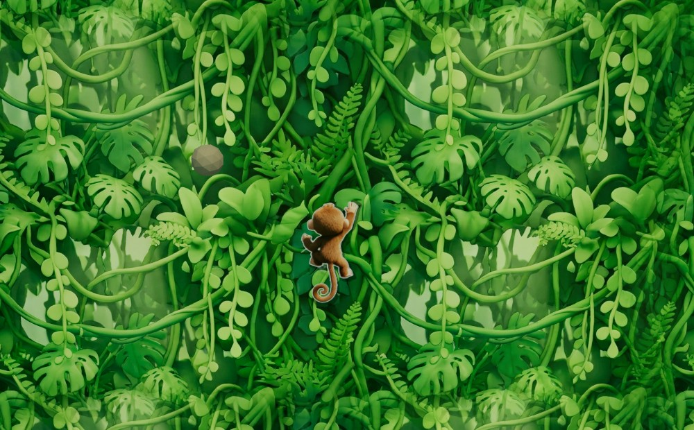
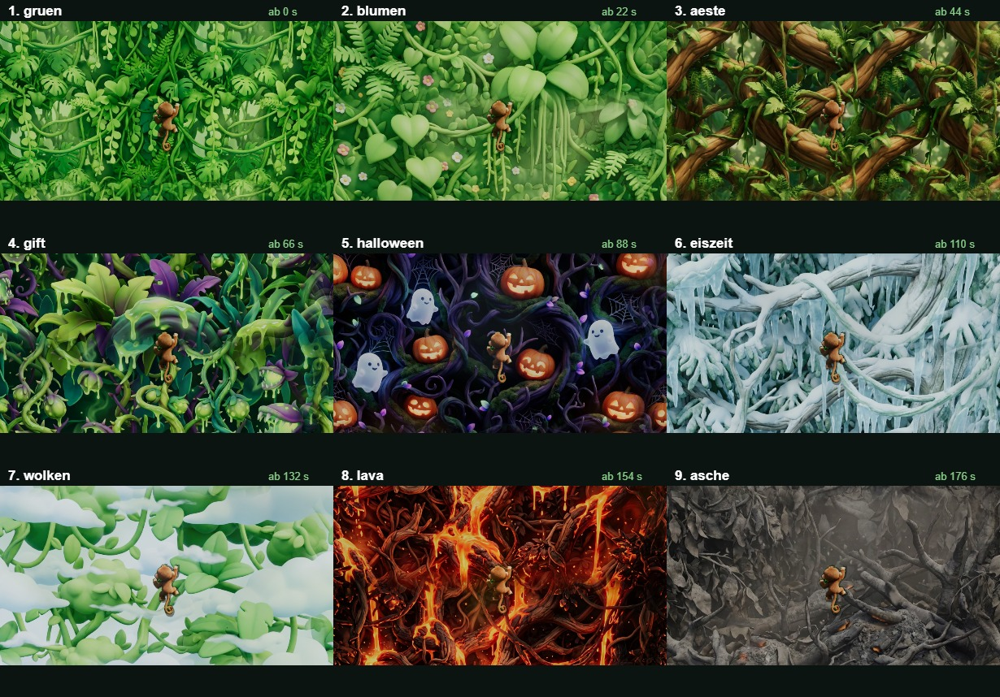
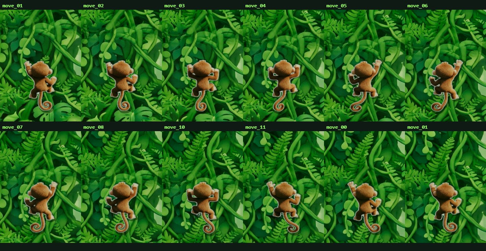

# Jungle Climber

Vertical-Climber Jump-and-Run mit Three.js + Vite + Vanilla JavaScript.
Ein Affe klettert eine zugewucherte Pflanzenwand hoch, weicht fallenden Steinen
aus und sammelt Bananen als Wiederbelebung. Ein Treffer beendet den Lauf.



Die neun Hintergrundstufen — gewechselt wird nur, wenn das Spiel schwerer wird:



Bewegungszustände des Sprites (hoch / runter / links / rechts):



---

## Schnellstart

```bash
npm install
```

```bash
npm run dev
```

Danach <http://localhost:5173> öffnen. Mehr braucht es nicht — die fertigen
Texturen liegen in `public/textures/`.

> Nur wenn du auf das 3D-Modell umstellst (`CONFIG.player.mode = 'model'`),
> ist zusätzlich `npm run convert:model` nötig: das Quell-FBX ist mit 94 MB
> nicht browsertauglich.

### Alle Skripte

| Skript | Zweck |
| --- | --- |
| `npm run dev` | Dev-Server mit Hot Reload |
| `npm run build` | Produktionsbuild nach `dist/` |
| `npm run preview` | Produktionsbuild lokal testen |
| `npm run prep:art` | Bereitet die Bilder aus `assets-src/art/` auf (nahtlos kacheln + Affe freistellen) |
| `npm run convert:model` | `Monkey_B1.Fbx` → komprimiertes `monkey.glb` (nur für `mode: 'model'`) |
| `npm run verify:model` | Prüft das GLB gegen die `clipMap` aus `config.js` |

---

## Steuerung

| Eingabe | Wirkung |
| --- | --- |
| `W` `A` `S` `D` | Bewegen (frei in der Wandebene) |
| Pfeiltasten | Alias für WASD |
| Virtueller Joystick unten links | Bewegen (Touch) |
| `Esc` / `P` | Pause |
| `Enter` / `Leertaste` | Starten bzw. Neustart |
| `F1` | Hitbox-Overlay + Debug-Werte ein/aus |

`W` bewegt den Affen nicht nur nach oben, sondern beschleunigt zusätzlich den
Aufstieg (`CONFIG.player.climbAssist`) — schneller klettern bringt mehr
Höhenmeter, holt die Steine aber auch schneller heran. `S` bremst den Aufstieg,
stoppt ihn aber nie ganz (`minScrollFactor`).

---

## Asset-Konvertierung

### Der exakte Befehl

```bash
npm run convert:model
```

Das Skript [`scripts/convert-model.mjs`](scripts/convert-model.mjs) führt zwei
Stufen aus:

**Stufe 1 — FBX → GLB** (via `FBX2glTF`, Binary aus dem npm-Paket `fbx2gltf`):

```bash
node_modules/fbx2gltf/bin/Windows_NT/FBX2glTF.exe \
  --input  assets-src/FbxUnity/Monkey_B1.Fbx \
  --output assets-src/.cache/monkey_raw \
  --binary
```

**Stufe 2 — Optimieren** (via `@gltf-transform`), in dieser Reihenfolge:

| Schritt | Wirkung |
| --- | --- |
| `dedup()` | doppelte Accessoren/Materialien/Texturen zusammenfassen |
| `resample({tolerance: 1e-4})` | redundante Keyframes entfernen (grösster Einzelgewinn) |
| `weld()` | für Smoothing-Gruppen aufgetrennte Vertices zusammenführen |
| `textureCompress()` | 4096 px PNG → **1024 px WebP**, Qualität 85 |
| `prune()` | nicht mehr referenzierte Knoten entfernen |
| `meshopt({level:'high'})` | `EXT_meshopt_compression` über Geometrie **und** Animationen |

Das Zwischenergebnis liegt in `assets-src/.cache/`. Stufe 1 wird bei erneutem
Lauf übersprungen; mit `npm run convert:model -- --force` wird sie erzwungen.

### Ergebnis

```
57.79 MB  ->  1.51 MB   (97.4 % kleiner)

Texturen   Body_B1_Normal    1024x1024 webp
           Body_B1_Diffuse   1024x1024 webp
           Eye_B1_Diffuse    1024x1024 webp
Clips      17
```

Damit liegt das Modell deutlich unter dem 6-MB-Ziel.

### Warum Meshopt und nicht Draco

Draco komprimiert **nur Mesh-Geometrie**. Der Löwenanteil dieses Assets sind
aber die 17 Animationsclips auf 101 Bones. `EXT_meshopt_compression` erfasst
Geometrie *und* Animations-Sampler und ist deshalb hier deutlich effektiver.
Three.js dekodiert das über den `MeshoptDecoder`, der in
[`src/core/AssetLoader.js`](src/core/AssetLoader.js) gesetzt wird.

### Kontrolle

```bash
npm run verify:model
```

Listet alle Clips, prüft, ob jeder in `config.js` referenzierte Clip wirklich im
GLB liegt, und ob die Schwanz-Bones für die prozedurale Simulation vorhanden
sind. Nach dem Nachrüsten echter Kletteranimationen ist das der schnellste Test.

---

## Projektstruktur

```
jungle-climber/
├── assets-src/
│   ├── art/                            Originalbilder (Hintergründe + Affe)
│   └── FbxUnity/Monkey_B1.Fbx          3D-Quell-Asset (nicht ausgeliefert)
├── public/
│   ├── models/monkey.glb               erzeugt von convert:model
│   └── textures/                       erzeugt von prep:art
│       ├── stage1_green.png  + _far    Hintergrundstufen
│       ├── stage2_flowers.png + _far
│       ├── stage3_branches.png + _far
│       └── monkey_sprite.png           freigestellter Affe
├── scripts/
│   ├── prepare-art.mjs                 nahtlos kacheln + freistellen
│   ├── convert-model.mjs               FBX -> komprimiertes GLB
│   └── verify-model.mjs                GLB gegen config.js prüfen
└── src/
    ├── config.js                       ← ALLE Balancing-Werte
    ├── main.js                         Einstiegspunkt
    ├── core/       Game (Loop), StateMachine, AssetLoader, viewport
    ├── input/      InputHandler (Tastatur + Touch-Joystick)
    ├── entities/   SpritePlayer, Player (3D), Rock, Banana, Pool
    ├── animation/  AnimationController, TailSimulation (nur 3D-Modus)
    ├── world/      PlantWall (Stufen + Parallax + Überblendung)
    ├── systems/    DifficultyCurve, Spawner, CollisionSystem, ScoreManager
    └── ui/         UI (DOM-Overlay), DebugOverlay (Hitboxen)
```

Zustände laufen über eine explizite State-Machine
(`MENU → PLAYING ⇄ PAUSED → GAME_OVER`); unerlaubte Übergänge werfen, statt das
Spiel still in einen inkonsistenten Zustand zu bringen.

---

## Balancing

**Alle** Zahlen stehen in [`src/config.js`](src/config.js) und sind kommentiert.
Sonst nirgends.

Die drei Difficulty-Kurven haben dieselbe Form:

```
wert(t) = clamp(start + rate * t, min, max)
```

| Kurve | Start | Rate | Deckel | erreicht nach |
| --- | --- | --- | --- | --- |
| `scroll` (Wandgeschwindigkeit) | 2.3 u/s | +0.052 /s | 8.2 u/s | ~113 s |
| `spawnInterval` (Steinabstand) | 1.16 s | −0.0092 /s | 0.27 s | ~97 s |
| `rockSpeed` (Fallgeschwindigkeit) | 3.9 u/s | +0.078 /s | 12.5 u/s | ~110 s |

Zusätzlich wächst die Burst-Grösse in Stufen (`difficulty.burst`): ab 35 s zwei,
ab 80 s drei Objekte pro Welle. Auf dem Bildschirm bewegt sich ein Stein mit
`rockSpeed + scroll` — die Scrollkurve verschärft also beides.

Zum Live-Testen: `F1` blendet Hitboxen und die aktuellen Kurvenwerte ein.
`window.__game.cfg` ist in der Konsole erreichbar.

> **`world.bounds` ist eine Obergrenze, kein Fixwert.** Das Sichtfeld ist
> vertikal definiert, die sichtbare Breite hängt also vom Seitenverhältnis ab.
> `Game._updateWorldBounds()` verengt `minX`/`maxX` und `spawnHalfWidth` bei
> jedem Resize auf das tatsächlich Sichtbare (im Hochformat auf ca. ±2 statt
> ±4.6), damit der Affe nicht seitlich aus dem Bild läuft und Steine nicht
> unsichtbar neben dem Bild fallen. Die wirksamen Werte stehen zur Laufzeit in
> `window.__game.worldView`.

---

## Kletteranimation nachrüsten

### Die `clipMap` ist die einzige Stelle, die angefasst werden muss

Die Spiellogik kennt **keine Clip-Namen**. Sie kennt nur logische Zustände:
`climbUp`, `climbDown`, `climbLeft`, `climbRight`, `climbIdle`, `dodge`.
Die Zuordnung steht ausschliesslich in `CONFIG.animation.clipMap`:

```js
climbUp: { clip: 'Run', timeScale: 1.0, speedSync: true,
           rollDeg: 180, pitchDeg: 88, loop: 'repeat' },
```

| Feld | Bedeutung |
| --- | --- |
| `clip` | Clip-Name im GLB |
| `timeScale` | Abspielgeschwindigkeit, **negativ = rückwärts** |
| `speedSync` | koppelt die Abspielgeschwindigkeit an die Bewegungsgeschwindigkeit |
| `rollDeg` | Drehung um die Bildnormale (Z) — seitliche Neigung |
| `pitchDeg` | Kippen um X — richtet Bodenclips zur Wandbewegung auf |
| `loop` | `'repeat'` oder `'once'` |

Liegen echte Kletterclips vor, genügt:

```js
climbUp:   { clip: 'Climb_Up',   timeScale: 1, speedSync: true, rollDeg: 0, pitchDeg: 0, loop: 'repeat' },
climbDown: { clip: 'Climb_Down', timeScale: 1, speedSync: true, rollDeg: 0, pitchDeg: 0, loop: 'repeat' },
```

`rollDeg`/`pitchDeg` gehen dabei auf 0 — die Umdeutung der Laufclips entfällt.
Danach `npm run verify:model` laufen lassen. **An der Spiellogik ändert sich
nichts.**

### Warum die Fallback-Werte so aussehen

`Run`, `RunR` und `Idle` sind **vierfüssige Bodenclips**: das Modell schaut in
`+Z`, der Rücken zeigt nach `+Y`, die Gliedmassen nach `−Y`. Damit daraus
Klettern wird, muss der Affe mit dem Bauch zur Wand und dem Kopf nach oben
stehen. Mit einer einzelnen Achse ist das nicht erreichbar (die nötige Abbildung
wäre eine Spiegelung). Nötig sind zwei Drehungen:

* `pitchDeg 88` kippt Bauch und Gliedmassen in die Wand
* `rollDeg 180` dreht den dabei kopfüber hängenden Affen richtig herum

`rollDeg 180` ist deshalb der **Nullpunkt** für seitliches Neigen: `climbLeft`
nutzt 156°, `climbRight` 204°.

### Option a) Eigenen Climb-Loop in Blender keyframen — empfohlen

16–24 Frames, diagonal alternierende Greifbewegung (rechte Hand + linker Fuss,
dann Gegenbewegung), sauber loopfähig, in-place (keine Wurzelversetzung).

**Auf dem Original-Rig arbeiten.** Dann gibt es keine Kompatibilitätsrisiken:
Bone-Namen, Hierarchie und Skinning bleiben identisch, und die 17 vorhandenen
Clips funktionieren unverändert weiter.

Als Ausgangspose eignet sich `ClimbIdle` — das ist die einzige echte
Kletterpose im Asset (aufrecht, alle vier Gliedmassen greifen).

> **Achtung Achsenkonvention:** `ClimbIdle` ist *umgekehrt* zu den Bodenclips
> animiert (aufrecht, Blick zur Kamera). Wer davon ausgeht, sollte den neuen
> Clip entweder in derselben Konvention bauen und in der `clipMap`
> `pitchDeg: 0, rollDeg: 0` setzen — oder gleich in der Bodenclip-Konvention
> arbeiten und die Fallback-Werte behalten.

Neue Clips ins bestehende GLB bringen: in Blender das GLB importieren, Actions
ergänzen, als GLB exportieren und über `public/models/monkey.glb` legen — oder
das FBX erweitern und `npm run convert:model -- --force` erneut laufen lassen.

### Option b) Fertige Animation (z. B. Mixamo) auf das Rig retargeten

Über Blender (Auto-Rig Pro / Rokoko) oder Unity Humanoid.

> ### ⚠️ WARNUNG — das Mesh NICHT bei Mixamo neu riggen lassen
>
> Mixamos Auto-Rigger erzeugt ein **anderes Skelett** (andere Bone-Namen, andere
> Hierarchie, andere Bindepose). Damit werden **alle 17 vorhandenen Clips
> unbrauchbar** — Run, Idle, Die, Eat, Roar, Smile, sämtliche Sit-Varianten.
> Nur die **Animation als Quelle** verwenden und **das bestehende Rig behalten**.

Für das Retargeting ist eine explizite Bone-Zuordnung nötig — die Namen sind
**nicht** Mixamo-kompatibel (siehe Rig-Referenz unten).

### Option c) Die Tail-Kette wird beim Retargeting NICHT übertragen

Ein humanoides Quell-Rig hat keinen Schwanz. Nach jedem Retargeting stünde der
Schwanz steif in der Bindepose.

Deshalb ist eine **prozedurale Sekundärbewegung** bereits implementiert:
[`src/animation/TailSimulation.js`](src/animation/TailSimulation.js) — eine
Spring/Damping-Kette über die sieben Tail-Bones, getrieben von der
Bewegungsgeschwindigkeit des Affen plus konstanter Schwerkraft. Sie läuft
**unabhängig vom abgespielten Clip** (nach `mixer.update()` direkt auf den
Bones) und ist per Config abschaltbar:

```js
CONFIG.animation.tail.enabled = false;
```

Parameter: `stiffness`, `damping`, `velocityInfluence`, `falloff`, `maxAngle`,
`gravity`. Die Simulation liest die Längsachse jedes Bones aus der Richtung zum
Kindbone und biegt quer dazu — sie funktioniert damit auch, wenn später ein
anders orientiertes Rig eingesetzt wird.

### Option d) Affenproportionen weichen von menschlichen ab

Lange Arme, kurze Beine, digitigrader Fuss. Beim Retargeting humanoider Clips
ist deshalb **Hand- und Fuss-Sliding zu erwarten** (Greifpunkte rutschen, Füsse
schwimmen). Das muss nachkorrigiert werden — üblich über IK-Constraints auf
Hände und Füsse in Blender oder manuelles Nachkeyen der Kontaktframes.

Zusätzlich sind die Beinketten unterschiedlich lang gegliedert (siehe unten),
was ein direktes 1:1-Mapping der Beine ohnehin verhindert.

### Rig-Referenz (verifiziert am konvertierten GLB)

| | |
| --- | --- |
| Skin-Joints | 101 |
| Wurzelkette | `RL_BoneRoot → SK_Mesh_Macaque → macaque_Pelvis_bone` |
| Namensschema | `macaque_<seite>_<teil>_bone`, Seite = `l` / `r` |
| Wirbelsäule | `Spine1 → Spine2 → Spine3 → Neck → Head` |
| Arm | `Scapula → Humerus → Forearm → Hand` (+ `HumerusRoll`, `ForearmRoll1/2`) |
| Bein | `Thigh → Knee → Ankle → Foot` |
| Schwanz | `macaque_Tail_1_bone` … `macaque_Tail_7_bone` (+ `_nub`) |
| Gesicht | Lider, `Jaw`, `Mandible`, `Snout`, Lippen-Helfer (`_hlp`) |

**Abweichungen von einem Standard-Biped — relevant fürs Retargeting:**

* **Keine Toe-Bones.** Der Fuss endet in `Foot` + `Foot_nub`; stattdessen hat
  jeder Fuss eine **vollständige 5-Finger-Kette** (`Finger1_1` … `Finger5_3`).
  Affenfüsse sind Hände. Ein humanoides Toe-Mapping läuft ins Leere.
* **Vier Beinsegmente statt drei.** `Thigh → Knee → Ankle → Foot` gegenüber
  menschlich `Thigh → Calf → Foot`. Das zusätzliche Gelenk muss beim Retargeting
  explizit zugeordnet werden.
* **Arm heisst `Scapula`/`Humerus`/`Forearm`**, nicht `Shoulder`/`UpperArm`.
* **Parallele FK/IK-Hilfsketten** (`*_FK_bone`, `*_IK_bone`) liegen als
  Geschwister unter `Scapula` und sind nicht Teil der Deform-Kette.

Das Rig ist also **kein sauberes humanoides Biped**, sondern ein anatomisches
Makaken-Rig. Retargeting ist möglich, braucht aber eine manuelle Bone-Map.

### Root Motion

Die Quellclips haben die Vorwärtsbewegung im Wurzel-Bone gebacken; zusätzlich
meldet FBX2glTF beim Konvertieren:

```
node /RootNode/RL_BoneRoot uses unsupported transform inheritance type 'eInheritRrs'
```

Dadurch sind genau diese Translationskanäle falsch skaliert — ohne Gegenmassnahme
wandert der Affe aus dem Bild. Der `AnimationController` entfernt deshalb die
`.position`-Kanäle der Wurzel-Bones aus **jedem** Clip (Rotationen bleiben):

```js
CONFIG.animation.stripRootMotion = {
  enabled: true,
  bones: ['macaque_Pelvis_bone', 'SK_Mesh_Macaque', 'RL_BoneRoot'],
};
```

Bei echten, sauber in-place gebauten Kletterclips kann das abgeschaltet werden.

---

## Spielfigur: Sprite oder 3D-Modell

`CONFIG.player.mode` schaltet um:

| Wert | Figur |
| --- | --- |
| `'sprite'` **(Standard)** | Frame-Animation aus dem Kletter-Spritesheet |
| `'model'` | `public/models/monkey.glb` — gerigtes Makaken-Modell mit 17 Clips und `clipMap` |

Im Sprite-Modus wird das GLB **gar nicht erst geladen** (spart 1.5 MB). Beide
Pfade sind vollständig implementiert; das Umschalten kostet eine Zeile.

### Die Kletteranimation

Die Bewegung stammt aus dem gelieferten Video
`assets-src/art/monkey_movement.mp4`: ein Kletterzyklus von **1.017 s**, zerlegt
in **12 Einzelbilder** und vom weissen Hintergrund freigestellt. Die fertigen
Frames liegen als `public/textures/move_00.webp` … `move_11.webp`.

Die Abspielreihenfolge steht in `CONFIG.sprite.frames` — Umsortieren, Kürzen
oder einzelne Frames auslassen geht ohne Codeänderung:

```js
frames: [0, 1, 2, 3, 4, 5, 6, 7, 8, 9, 10, 11],
```

| Zustand | Was passiert |
| --- | --- |
| hoch | Frames vorwärts, Tempo an die Bewegungsgeschwindigkeit gekoppelt |
| runter | **dieselben** Frames rückwärts — keine eigene Abwärts-Sequenz |
| links / rechts | Frames laufen weiter |
| Stillstand | hält `idleFrame` |
| Treffer | sackt nach unten weg |

### Keine prozedurale Zusatzbewegung

Das Sprite wird **unverändert** dargestellt — nicht gedreht, nicht geneigt,
nicht gestaucht, nicht gespiegelt. Die gesamte Bewegung kommt aus den Frames.

Frühere Fassungen hatten zusätzlich Nicken, Neigung in Laufrichtung,
Stauchen/Strecken und eine Spiegelung beim Richtungswechsel. Das ist bewusst
entfernt: besonders die Spiegelung lief über `scale.x` durch die Null und sah
aus, als würde sich der Affe drehen. Auch der Sturz beim Treffer dreht sich
nicht mehr, er fällt nur noch nach unten.

Banane, Wiederbelebung und Start melden sich nur noch über das HUD zurück —
die früheren Skalierungs-Impulse am Sprite sind weg.

> **Ausrichtung der Frames:** Die Silhouette wandert von Frame zu Frame (der
> Affe klettert ja durchs Bild). Einfach ausgeschnitten würde er beim
> Abspielen umherspringen. `prepare-art.mjs` beschneidet deshalb jedes Frame
> auf seine Alpha-Bounding-Box und legt es mittig auf eine für alle Frames
> gemeinsame Leinwand. Sie wird **je Satz** neu berechnet — braun 407 × 725,
> weiss 455 × 865, orange 538 × 889. Ihr Seitenverhältnis bestimmt im Spiel
> die Sprite-Breite (`w = spriteHeight × aspect`), jeder Affe bekommt also
> seine eigenen Proportionen.

### Charaktere

Es gibt drei Affen zur Auswahl. Alle Werte stehen in `CONFIG.characters.list`;
**braun** wiederholt dort die Werte aus `CONFIG.player` wörtlich und ist die
1.0-Referenz.

| | braun | weiss | orange |
|---|---|---|---|
| `spriteHeight` | 2.5 | 1.25 (×0.5) | 2.5 |
| `moveSpeed` | 6.4 | 8.3 (×1.30) | 5.1 (×0.80) |
| `climbAssist` | 1.9 | 2.5 (×1.32) | 1.5 (×0.79) |
| `hitRadius` | 0.42 | 0.21 (×0.5) | 0.42 |
| `cycleSpeed` | 1.4 | 1.9 | 1.1 |
| Kletterbilder | 12 | **10** | 12 |
| Bananen / Wiederbelebung | ja | **nein** | ja |
| prallt ab an Steinen bis | — | — | Radius **0.38** |

Drei Dinge, die beim Nachbauen leicht danebengehen:

- **`moveSpeed` gilt für BEIDE Achsen**, ein getrenntes X/Y gibt es nicht.
  Das vertikale Tempo hängt zusätzlich an `climbAssist`, und das wird in
  `Game._updatePlaying()` an der Spielfigur vorbei gelesen. Wer nur
  `moveSpeed` ändert, bekommt einen Affen, der seitlich langsamer ist, aber
  unverändert schnell klettert.
- **`cycleSpeed` muss je Charakter gesetzt werden.** Die Bildrate wird auf
  `moveSpeed` normiert (`speedRatio = animSpeed / cfg.moveSpeed`), ist bei
  vollem Input also für jeden Affen gleich 1. Ein höheres `moveSpeed` allein
  macht die Animation nicht schneller.
- **Die Kleinstein-Immunität gehört in die Kollisionsschleife**, nicht in den
  Treffer-Handler. Die Schleife bricht beim ersten Überlappen mit `return`
  ab — ein erst später aussortierter Kleinstein hätte den einen
  Kollisionstest des Frames verbraucht und einen gleichzeitig überlappenden
  grossen Stein unsichtbar abgeschirmt.
- **Jeder Affe hat seine eigene Bildzahl** (`frames` je Charakter). Die
  Videos enthalten unterschiedlich viele wirklich verschiedene Posen pro
  Zyklus; beim weissen sind es 10, nicht 12.

`_pickCharacter()` ist **asynchron** (beim ersten Wählen werden die Frames
nachgeladen), wird aber aus einem Klick-Callback ohne `await` gerufen. Ohne
Absicherung riss ein noch laufender Wechsel hinterher das Hauptmenü über ein
inzwischen gestartetes Spiel — der Zustand blieb `PLAYING`, `showScreen`
feuerte nie wieder, und "Spiel starten" war danach tot. Zwei Riegel dagegen:
eine laufende Nummer (`_wechselNummer`), die überholte Wechsel verwirft, und
ein gesperrter Zurück-Knopf während des Ladens.

### Der Affe klettert auch im Menü

In Menü, Charakterauswahl und Game Over läuft der Kletterzyklus weiter
(`CONFIG.sprite.ambientCycleRatio`, `SpritePlayer.updateAmbient()`). Das ist
nötig, weil `Game` dort bewusst **nicht** `player.update()` ruft — es gibt
keine Eingabe und keine Physik — die Bildfolge aber genau dort steckte. Die
Wand scrollt in diesen Bildschirmen weiter, ein starrer Affe davor sah aus,
als hinge das Spiel.

Die Pause bleibt bewusst ein **Standbild**. Und wer tot ist, klettert nicht
wieder los: `_animate()` hält von selbst die Sturzpose.

Die Auswahl merkt sich `CharacterStore` unter
`jungle-climber.character.v1` (nur die ID, nie das ganze Objekt — sonst wären
Balancing-Änderungen bei jedem Spieler eingefroren). Beim Start wird nur der
gewählte Frame-Satz geladen; die anderen kommen beim ersten Auswählen dazu.

Die Menü-Bilder entstehen mit `npm run prep:chars` aus
`assets-src/art/characters/*.png` und landen in `public/characters/`. Das
Skript stellt den Affen vor dem Blattwerk frei und beschneidet den Ast an
ihm. Den Affen findet es über die **Spaltenhöhe**: der Ast ist ein flaches
Band über die ganze Breite, der Affe ragt mit Kopf und Schwanz weit darüber
hinaus. Zwei naheliegendere Wege scheitern an den Lianen — die sind ebenfalls
braun und laufen quer durchs Bild, und beim weissen Affen ist die Liane sogar
*dicker* als er selbst.

### Kletteranimation aus dem Video

Das Zerlegen der Videos ist ein **einmaliger** Schritt und steckt nicht in
`prep:art` — es gibt kein ffmpeg auf dem System, dekodiert wird im Browser.
Ab den fertigen PNGs in `assets-src/art/movement*/` ist alles reproduzierbar.

Inzwischen erledigt das `scripts/video-to-frames.mjs`:

```
npm run video:frames -- probe   assets-src/video/monkey_movement_white.mp4 24
npm run video:frames -- extract assets-src/video/monkey_movement_white.mp4 movement_white 12
```

Das Skript startet einen kleinen lokalen Server und öffnet eine Seite, die das
Video zerlegt und die fertigen PNGs zurückschickt. **Die Seite muss in einem
sichtbaren Fenster im Vordergrund laufen** — ein gedrosselter Hintergrundtab
präsentiert keine Videobilder, das Springen liefert dann immer dasselbe Bild.
Eine Selbstkontrolle am Anfang bricht genau dafür mit einer Meldung ab.

Weitere Fallen, die alle einmal zugeschlagen haben:

- Das `<video>`-Element **muss im Dokument hängen**. Ein loses Element liefert
  beim Springen weiter das zuerst dekodierte Bild — alle zwölf Frames kamen
  byte-identisch heraus.
- Der Server **muss Bereichsanfragen beantworten** (HTTP 206). Ohne
  `Accept-Ranges` kann der Browser im Video nicht springen.
- Die Loop-Suche darf die Bilder **nicht** auf ihre Silhouette normieren. Der
  Affe klettert auf der Stelle, die Bewegung steckt genau in der
  Verschiebung — normiert man sie weg, ist der Abstand für alle Stichproben 0.
- Der Server muss `Cache-Control: no-store` senden. Sonst liefert der Browser
  eine zwischengespeicherte Fassung der Seite aus, und Änderungen am Skript
  wirken schlicht nicht.
- **Nicht stur gleichmässig abtasten.** Die Videos haben eine niedrigere
  Bildrate als die gewünschte Bildzahl, man trifft also mehrfach dasselbe
  Quellbild. Gemessen an den Nachbarabständen der fertigen Frames: der
  bewährte braune Satz liegt nie unter 33, der erste weisse Versuch hatte
  drei Paare bei 0.6–1.0 — die Animation hakte dreimal pro Zyklus. Das Skript
  tastet deshalb vierfach dicht ab und behält nur, was sich vom zuletzt
  behaltenen Bild sichtbar unterscheidet. Es meldet am Ende, wie viele Bilder
  wirklich herauskamen — diese Zahl gehört in `frames` des Charakters.

Das erste Video (brauner Affe) lief vor **reinweissem** Hintergrund, die
beiden neuen vor einer **grauen Wand** mit Schlagschatten. Ein blosser
Farbabstand zur Wandfarbe trennt den Schatten nicht mehr — beim orangen Video
liegt er weiter von der Wand entfernt als manche Stelle des Affen. Gemessen
wird deshalb `max(Buntheit, Aufhellung)`: Wand und Schatten sind neutrales
Grau, der Affe ist bunt oder heller, und ein Schatten ist nie bunter als die
Wand.

<details>
<summary>So wurde der braune Satz ursprünglich von Hand zerlegt</summary>

So wurde es gemacht (bei laufendem Dev-Server, in der Browser-Konsole):

1. Video nach `public/` legen und über ein `<video>`-Element laden.
2. Loop-Länge bestimmen: gleichmässig Frames abtasten, jedes auf die
   Alpha-Box zentrieren und den Abstand zu Frame 0 messen. Das erste klare
   Minimum ist die Periode — hier **5 von 24 Stichproben ≈ 1.017 s**.
3. Genau diesen Zyklus mit 12 Bildern erneut abtasten (Endpunkt auslassen,
   sonst doppelt sich das erste Bild).
4. Je Bild das Weiss per Alpha-Keying entfernen
   (`alpha = (255 − min(r,g,b) − 6) / 20`, weiche Kante), auf die Silhouette
   zuschneiden und als PNG nach `assets-src/art/movement/` schreiben.

Kontrolle: der Abstand vom letzten zum ersten Frame lag bei 30 gegenüber 25.8
im Schnitt zwischen Nachbarn — der Loop schliesst also sauber.

> **Weiss-Saum:** Halbtransparente Randpixel tragen noch das Weiss des
> Videohintergrunds und ergeben vor dem grünen Dschungel einen hellen Saum.
> `prepare-art.mjs` rechnet ihn heraus — die Hintergrundfarbe ist bekannt,
> also lässt sich der Vordergrund exakt zurückgewinnen:
> `C_fg = (C_beobachtet − (1−a)·255) / a`.
>
> Das gilt **nur für den braunen Satz** (`weissSaum: true` in `MOVE_SETS`).
> Die beiden neuen Sätze sind bereits in `video-to-frames.mjs` gegen die
> gemessene Wandfarbe entsäumt; ein zweiter Durchgang gegen Weiss würde ihre
> Kante fälschlich aufhellen.

</details>

Hinter dem Sprite liegt ein weicher dunkler Umriss (`CONFIG.sprite.outline`).
Der ist **nicht** nur Kosmetik: der Affe ist braun, und auf der Lava-Stufe ist
der Hintergrund ebenfalls orange-braun — ohne Absetzung verschwindet die
Spielfigur dort fast. Der Umriss löst sie auf jeder Stufe vom Untergrund.

Die Zyklusgeschwindigkeit hängt an der Bewegungsgeschwindigkeit. Alle Werte
(Nickhöhe, Neigung, Spiegelschwelle, Ereignisdauern) stehen in
`CONFIG.sprite`.

Der Sprite-Modus lädt nur die Frames, die der Zyklus benutzt — die übrigen
liegen bereit, ohne den Start zu verzögern.

---

## Hintergründe austauschen

Die Wand hat **neun Stufen**, die in `CONFIG.wall.stages` stehen:

| # | Stufe | Ab Sekunde | Was dort zusätzlich schwerer wird |
| --- | --- | --- | --- |
| 1 | grün | 0 | Start |
| 2 | grün mit Blumen | 22 | Burst 1 → **2** |
| 3 | Äste | 44 | Scroll- und Steingeschwindigkeit steigen weiter |
| 4 | Gift | 66 | Burst 2 → **3** |
| 5 | Halloween | 88 | Rampe läuft weiter |
| 6 | Eiszeit | 110 | Burst 3 → **4** |
| 7 | Wolken | 132 | Rampe läuft weiter (Deckel bei 138 s) |
| 8 | Lava | 154 | Burst 4 → **5** |
| 9 | Asche | 176 | Burst 5 → **6** |

**Gewechselt wird nur an diesen Schwellen.** Jede fällt mit einem echten
Schwierigkeitssprung zusammen — entweder steigt dort die Burst-Grösse
(`CONFIG.difficulty.burst`) oder die Geschwindigkeitsrampen laufen noch hoch.

> Damit das auch für die späten Stufen gilt, sind die Deckel angehoben
> (Scroll 8.2 → 9.5, Steingeschwindigkeit 12.5 → 15) und es gibt Burst-Stufen
> bis 6. Ohne das wäre ab ~110 s nichts mehr schwerer geworden, und Lava und
> Asche hätten ohne Anlass gewechselt. Start- und Steigungswerte sind
> unverändert, das frühe Spiel fühlt sich also gleich an.

Dazwischen kachelt dieselbe Textur endlos weiter. Nach der letzten Stufe geht
es alle `stageLoopSeconds` (45 s) zyklisch von vorne los — die Hintergründe
kommen also immer wieder. Der Wechsel ist eine Überblendung über
`stageFade` (1.8 s), kein Schnitt.

Verifiziert: `0 grün · 22 blumen · 44 äste · 66 gift · 88 halloween ·
110 eiszeit · 132 wolken · 154 lava · 176 asche · 221 wieder grün`.

### Eigene Bilder einsetzen

Die Originale nach `assets-src/art/` legen — die Dateinamen stehen in der
Liste oben in [`scripts/prepare-art.mjs`](scripts/prepare-art.mjs)
(`stage1_green.png` … `stage9_ash.png`, `monkey_raw.png`), dann:

```bash
npm run prep:art
```

[`scripts/prepare-art.mjs`](scripts/prepare-art.mjs) erledigt zwei Dinge, die
sonst leicht übersehen werden:

1. **Nahtlos kacheln.** Die gelieferten Bilder waren es *nicht* (gemessene
   Kantendifferenz 21–45 von 255) — beim endlosen Scrollen liefe eine
   sichtbare waagerechte Kante durchs Bild. Das Skript kürzt das Bild um ein
   Überblendband und blendet den Anfang in das abgeschnittene Ende über;
   danach grenzen zwei im Original *benachbarte* Zeilen aneinander
   (Restfehler 4–5 von 255).

   > Spiegeln (`MirroredRepeatWrapping`) wäre der naheliegende Trick, ist hier
   > aber falsch: in gespiegelten Kacheln läuft der Inhalt bei wachsendem
   > Offset rückwärts — die Wand würde abwechselnd hoch und runter scrollen.

2. **Affen freistellen.** Rein lokal, ohne externe Dienste: Fell ist braun
   (R > G), Blattwerk grün. Aus der Rohmaske wird die grösste zusammen-
   hängende Fläche genommen, dilatiert (rettet den dünnen Schwanz), Löcher
   gefüllt, Kante geglättet und auf die Silhouette zugeschnitten.

Zusätzlich entsteht je Stufe eine unscharfe, dunklere `*_far.png` für die
Vordergrundebene.

### Ebenen

| Ebene | Textur | z | Parallax | Deckkraft |
| --- | --- | --- | --- | --- |
| `spielebene` | `near` | −0.9 | 1.0 | 1.0 |
| `vordergrund` | `far` (unscharf) | +3.0 | 1.5 | 0.16 |

Nur zwei Ebenen, und das mit Absicht: die Stufentexturen sind **deckend** —
eine zweite deckende Ebene dahinter wäre vollständig verdeckt und damit
wirkungslos. Tiefe entsteht deshalb über die unscharfe, halbdurchsichtige
Ebene *vor* der Spielebene, die schneller scrollt.

> Der Vordergrund liegt **vor** dem Affen. `opacity` nicht erhöhen — sonst
> verschluckt er die Spielfigur.

Die Plane-Grösse wird zur Laufzeit aus dem Kamera-Frustum berechnet, ist also
bei jedem Seitenverhältnis bildfüllend. Die Kacheldichte steuert
`tileWorldHeight` (kleiner = kleineres Muster); `tileAspect` hält die Kacheln
unverzerrt.

---

## Abweichungen von der Spezifikation

Drei Punkte liessen sich nicht wie vorgegeben umsetzen, weil das gelieferte
Asset anders aussieht als beschrieben:

1. **`RunL` existiert nicht.** Das FBX enthält **17** Clips, nicht 18 — es gibt
   `Run` und `RunR`, aber kein `RunL` (im Binary null Treffer). `climbLeft`
   nutzt deshalb `RunR` mit gespiegeltem `rollDeg`. Sobald ein echter Clip
   vorliegt: eine Zeile in der `clipMap`.

2. **`climbIdle` nutzt `Idle` statt `ClimbIdle`.** `ClimbIdle` ist in der
   umgekehrten Achsenkonvention animiert (aufrecht, Blick zur Kamera), die
   Laufclips sind Bodenclips. Gemischt würde der Affe bei **jedem Anhalten** um
   ~180° kippen. `Idle` ist wie `Run` ein Bodenclip und passt nahtlos. Rückgängig
   zu machen mit einer Zeile in der `clipMap`.

3. **Das Rig ist kein Standard-Biped.** Die Namenskonvention lautet nicht
   `Pelvis/Spine/Neck/Head/Thigh/Foot/Toe/Hand`, sondern `macaque_*_bone`; es
   gibt keine Toe-Bones und vier statt drei Beinsegmente (Details oben). Für die
   Tail-Simulation und das Stripping der Root Motion sind die tatsächlichen
   Namen in `config.js` hinterlegt.

---

## Build

```bash
npm run build
```

Ergebnis in `dist/`. `vite.config.js` benutzt `base: './'`, der Build läuft also
auch in einem Unterordner (`https://example.com/jungle-climber/`).
Asset-Pfade werden in `AssetLoader` gegen `import.meta.env.BASE_URL` aufgelöst.
