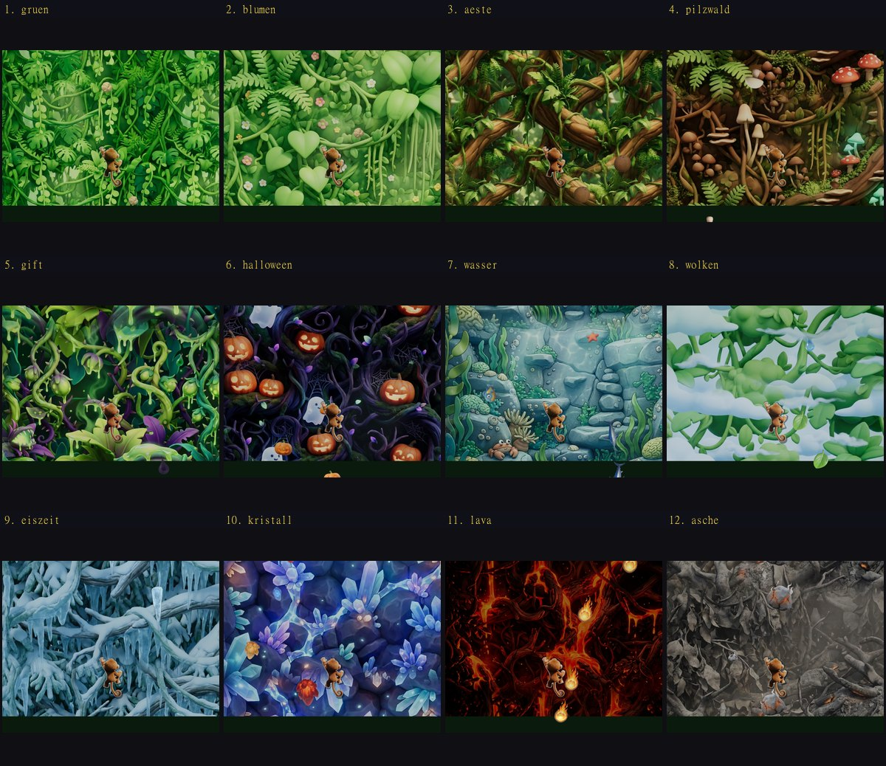

# Jungle Climber

Vertical-Climber Jump-and-Run mit Three.js + Vite + Vanilla JavaScript.
Ein Affe klettert eine zugewucherte Pflanzenwand hoch, weicht fallenden Steinen
aus und sammelt Bananen als Wiederbelebung. Ein Treffer beendet den Lauf.


Zwölf Wände. Jede wirft etwas anderes ab, und jede ist ein Viertel schwerer
als die davor — der Wechsel ist die Ansage, nicht die Dekoration. Dass dabei
**immer** ein Weg hindurch bleibt, ist geprüft und nicht gehofft (siehe
[Es gibt immer einen Weg durch](#es-gibt-immer-einen-weg-durch)).



*Zwölf Wände, jede mit eigenen fallenden Objekten. Freigestellt aus den
Vorlagen: [`docs/objekte.jpg`](docs/objekte.jpg)*

Bewegungszustände des Sprites (hoch / runter / links / rechts):


---

## Schnellstart

```bash
npm install
```

```bash
npm run dev
```

Danach <http://localhost:5173> öffnen. Mehr braucht es nicht — die fertigen
Texturen liegen in `public/textures/`.

> Nur wenn du auf das 3D-Modell umstellst (`CONFIG.player.mode = 'model'`),
> ist zusätzlich `npm run convert:model` nötig: das Quell-FBX ist mit 94 MB
> nicht browsertauglich.

### Alle Skripte

| Skript | Zweck |
| --- | --- |
| `npm run dev` | Dev-Server mit Hot Reload |
| `npm run build` | Produktionsbuild nach `dist/` |
| `npm run preview` | Produktionsbuild lokal testen |
| `npm run prep:art` | Bereitet die Bilder aus `assets-src/art/` auf (nahtlos kacheln + Affe freistellen) |
| `npm run prep:hazards` | Zerlegt `assets-src/hazards/` in einzelne freigestellte Objekt-Sprites |
| `npm run test:fair` | Beweist, dass jederzeit eine Lücke zum Durchkommen bleibt |
| `npm run balance` | Rechnet die Schwierigkeit je Wand in eine Tabelle aus |
| `npm run convert:model` | `Monkey_B1.Fbx` → komprimiertes `monkey.glb` (nur für `mode: 'model'`) |
| `npm run verify:model` | Prüft das GLB gegen die `clipMap` aus `config.js` |

---

## Steuerung

**Nur links und rechts.** Der Affe steht senkrecht fest (`CONFIG.player.startPosition[1] = -0.1`, knapp unter der Bildmitte) und weicht ausschliesslich seitlich aus. Hoch und runter gibt es nicht — `W`/`S` und die Pfeiltasten hoch/runter bewegen ihn nicht mehr. Sie bleiben nur deshalb in `CONFIG.input.keys` belegt, damit der Browser bei den Pfeiltasten nicht die Seite scrollt.

Auf dem Handy tippt man **irgendwo** hin und zieht seitwärts; der Ring erscheint unter dem Finger. Der frühere Joystick mit festem Platz unten links ist weg. Knöpfe, Eingabefelder und Aufklapper haben weiterhin Vorrang — seit die Trefferprüfung auf das untere linke Viertel entfallen ist, ist diese Liste (`onControl` in `InputHandler`) der einzige Schutz vor Fehlgriffen.

| Eingabe | Wirkung |
| --- | --- |
| `A` / `D` | Nach links und rechts |
| Pfeiltasten | Alias dafür |
| Irgendwo tippen und ziehen | Nach links und rechts (Touch) |
| `Esc` / `P` | Pause |
| `Enter` / `Leertaste` | Starten bzw. Neustart |
| `F1` | Hitbox-Overlay + Debug-Werte ein/aus |

`W` bewegt den Affen nicht nur nach oben, sondern beschleunigt zusätzlich den
Aufstieg (`CONFIG.player.climbAssist`) — schneller klettern bringt mehr
Höhenmeter, holt die Steine aber auch schneller heran. `S` bremst den Aufstieg,
stoppt ihn aber nie ganz (`minScrollFactor`).

---

## Asset-Konvertierung

### Der exakte Befehl

```bash
npm run convert:model
```

Das Skript [`scripts/convert-model.mjs`](scripts/convert-model.mjs) führt zwei
Stufen aus:

**Stufe 1 — FBX → GLB** (via `FBX2glTF`, Binary aus dem npm-Paket `fbx2gltf`):

```bash
node_modules/fbx2gltf/bin/Windows_NT/FBX2glTF.exe \
  --input  assets-src/FbxUnity/Monkey_B1.Fbx \
  --output assets-src/.cache/monkey_raw \
  --binary
```

**Stufe 2 — Optimieren** (via `@gltf-transform`), in dieser Reihenfolge:

| Schritt | Wirkung |
| --- | --- |
| `dedup()` | doppelte Accessoren/Materialien/Texturen zusammenfassen |
| `resample({tolerance: 1e-4})` | redundante Keyframes entfernen (grösster Einzelgewinn) |
| `weld()` | für Smoothing-Gruppen aufgetrennte Vertices zusammenführen |
| `textureCompress()` | 4096 px PNG → **1024 px WebP**, Qualität 85 |
| `prune()` | nicht mehr referenzierte Knoten entfernen |
| `meshopt({level:'high'})` | `EXT_meshopt_compression` über Geometrie **und** Animationen |

Das Zwischenergebnis liegt in `assets-src/.cache/`. Stufe 1 wird bei erneutem
Lauf übersprungen; mit `npm run convert:model -- --force` wird sie erzwungen.

### Ergebnis

```
57.79 MB  ->  1.51 MB   (97.4 % kleiner)

Texturen   Body_B1_Normal    1024x1024 webp
           Body_B1_Diffuse   1024x1024 webp
           Eye_B1_Diffuse    1024x1024 webp
Clips      17
```

Damit liegt das Modell deutlich unter dem 6-MB-Ziel.

### Warum Meshopt und nicht Draco

Draco komprimiert **nur Mesh-Geometrie**. Der Löwenanteil dieses Assets sind
aber die 17 Animationsclips auf 101 Bones. `EXT_meshopt_compression` erfasst
Geometrie *und* Animations-Sampler und ist deshalb hier deutlich effektiver.
Three.js dekodiert das über den `MeshoptDecoder`, der in
[`src/core/AssetLoader.js`](src/core/AssetLoader.js) gesetzt wird.

### Kontrolle

```bash
npm run verify:model
```

Listet alle Clips, prüft, ob jeder in `config.js` referenzierte Clip wirklich im
GLB liegt, und ob die Schwanz-Bones für die prozedurale Simulation vorhanden
sind. Nach dem Nachrüsten echter Kletteranimationen ist das der schnellste Test.

---

## Projektstruktur

```
jungle-climber/
├── assets-src/
│   ├── art/                            Originalbilder (Wände + Affe)
│   ├── hazards/                        Vorlagen der fallenden Objekte
│   └── FbxUnity/Monkey_B1.Fbx          3D-Quell-Asset (nicht ausgeliefert)
├── public/
│   ├── models/monkey.glb               erzeugt von convert:model
│   ├── hazards/                        erzeugt von prep:hazards
│   │   └── stein_klein.webp …          ein Objekt je Datei, mit Alpha
│   └── textures/                       erzeugt von prep:art
│       ├── stage1_green.webp  + _far   Wände (Nummer = Lieferung,
│       ├── …                           nicht Reihenfolge im Spiel)
│       ├── wall_mushroom.webp + _far
│       └── move_00.webp …              Kletter-Frames
├── scripts/
│   ├── prepare-art.mjs                 nahtlos kacheln + freistellen
│   ├── fairness.mjs                    BEWEIST die Lücken-Garantie
│   ├── balance.mjs                     Schwierigkeit je Wand als Tabelle
│   ├── prepare-hazards.mjs             Objektbilder zerlegen + freistellen
│   ├── convert-model.mjs               FBX -> komprimiertes GLB
│   └── verify-model.mjs                GLB gegen config.js prüfen
└── src/
    ├── config.js                       ← ALLE Balancing-Werte
    ├── main.js                         Einstiegspunkt
    ├── core/       Game (Loop), StateMachine, AssetLoader, viewport
    ├── input/      InputHandler (Tastatur + Touch-Joystick)
    ├── entities/   SpritePlayer, Player (3D), Rock, Banana, Pool
    ├── animation/  AnimationController, TailSimulation (nur 3D-Modus)
    ├── world/      PlantWall (Stufen + Parallax + Überblendung)
    ├── systems/    DifficultyCurve (Härte je Wand), Spawner,
    │               Korridor (die garantierte freie Bahn),
    │               CollisionSystem, ScoreManager, CharacterStore,
    │               SkinStore, AdService (zweites Leben per Werbung)
    └── ui/         UI (DOM-Overlay), DebugOverlay (Hitboxen + Bahn)
```

Zustände laufen über eine explizite State-Machine
(`MENU → PLAYING ⇄ PAUSED → GAME_OVER`); unerlaubte Übergänge werfen, statt das
Spiel still in einen inkonsistenten Zustand zu bringen. Das Weiterspielen nach
dem Tod braucht **keinen** neuen Zustand: `GAME_OVER → PLAYING` gab es schon,
nur die Screens „Weiterklettern?" und „Werbung" liegen darüber.

---

## Es gibt immer einen Weg durch

Das ist keine Absicht, sondern eine **Zusicherung** — und sie ist geprüft.

### Warum „pro Welle eine Lücke lassen" nicht reicht

Gemessen am Stand davor ([`scripts/fairness.mjs`](scripts/fairness.mjs)):
**16 von 16 Läufen** endeten in einer Lage, aus der kein Spieler mehr
herauskam. Der aufschlussreiche Teil war nicht *dass* es passierte, sondern
*wie*:

```
Seed 32676  bei 192.3s  Wand "wolken"
  Objekte auf Spielerhöhe: g@-3.66  g@-0.82
  Abstände: 2.84
```

Zwei Objekte. 2.84 Einheiten Platz dazwischen, gebraucht werden 2.11. Und der
Affe stirbt trotzdem — weil er längst in einer Sackgasse stand, während
anderswo im Bild fünf Einheiten frei waren.

Eine faire Lücke muss also zweierlei sein: **frei und erreichbar**. Zusammen
ist das kein Zustand, sondern ein Weg — eine durchgehende Bahn durch Raum
*und* Zeit.

### Der Korridor

[`src/systems/Korridor.js`](src/systems/Korridor.js) führt eine unsichtbare
freie Bahn `x(t)` als Streckenzug, der bewusst in die **Zukunft** reicht. Ein
Objekt wird jetzt abgeworfen, kommt beim Affen aber erst in ein bis drei
Sekunden an — gefragt wird deshalb nicht „wo ist die Bahn jetzt", sondern
„wo wird sie sein, während dieses Objekt den Affen passiert".

Damit wird die Garantie eine Rechnung statt einer Hoffnung:

1. **Objekte fallen senkrecht.** Ihr `x` ändert sich nie. Schon beim Abwurf
   steht fest, wo eines den Affen passieren wird. *(Dafür wurde das seitliche
   Trudeln ersatzlos entfernt — mit wanderndem `x` ist keine Zusicherung
   möglich, nur Hoffnung.)*
2. **Gefährlich ist ein Objekt nicht in einem Moment**, sondern während es das
   ganze Bewegungsband durchquert. Daraus wird ein Zeitfenster `[tEin, tAus]`,
   das beide Extreme des Spielerverhaltens abdeckt: mit `W` fällt alles
   schneller, mit `S` langsamer.
3. Aus der Bahn wird geholt, **wo sie in genau diesem Fenster überall
   verläuft** (`korridor.spanne(t1, t2)`).
4. Das Objekt kommt ausserhalb dieser Spanne plus aller Radien.
5. Passt nichts mehr, **entfällt das Objekt**. Die Garantie schlägt die
   Wunsch-Anzahl.

Die Bahn bewegt sich höchstens mit `tempoAnteilSpieler` (0.55) der
Laufgeschwindigkeit des **gewählten** Affen — eine Bahn, der man nicht folgen
kann, wäre keine Garantie. Der langsame orange Affe bekommt deshalb eine
ruhigere als der flinke weisse.

> **Der Korridor ist nicht die einzige Lücke.** Zwischen den Objekten
> ausserhalb entstehen laufend weitere. Er ist die Zusicherung, dass es immer
> *einen* Weg gibt — nicht der einzige. Sichtbar ist er nie; mit `F1` wird er
> als Band eingeblendet.

### Immer nur eines

Es fällt **ein** Objekt zur Zeit. Mal ein grosser Brocken rechts, dann ein
kleiner links, dann drei kleine hintereinander — nie ein Haufen. Der Druck
kommt daher, dass der Strom schneller wird, nicht breiter.

Die Regel klingt trivial und ist es nicht, weil sie bei der **Ankunft** gelten
muss, nicht beim Abwurf: Objekte fallen unterschiedlich schnell (klein 1.25×,
gross 0.82×), ein sauber versetzt abgeworfener kleiner Stein holt einen
Brocken also unterwegs ein. Der erste Anlauf prüfte nur die Ankunftszeit beim
Affen — gemessen kamen sich Objekte trotzdem in **3.68 %** der Frames ins
Gehege, weil sie sich weiter oben im Bild überholten.

Geprüft wird deshalb der engste Moment über den **ganzen sichtbaren Flug**.
Weil beide mit konstantem Tempo fallen, ist der Abstand linear in der Zeit:

```
nötig: vorsprung ≥ abstand + max(0, v_neu − v_alt) · restflugzeit
```

Und `abstand` ist keine feste Zahl, sondern kommt aus den **Bildern**: zwei
Eiszapfen (je 2.45 hoch) brauchen mehr Platz als zwei Steine (je 1.0). Mit
einem gemeinsamen Wert wäre das eine zu knapp und das andere unnötig weit.

Gemessen über 8 Spielminuten: **0 von 28 800 Frames** mit sich überlappenden
Objekten, im Schnitt 2.1 gleichzeitig im Bild, höchstens 5.

### Der Beweis

```bash
npm run test:fair
```

Ein Bot, der stirbt, beweist nur, dass *dieser* Bot zu dumm war. Ein Bot, der
überlebt, nur dass es *diesmal* gutging. [`scripts/fairness.mjs`](scripts/fairness.mjs)
führt stattdessen die Menge **aller** Positionen mit, an denen ein Spieler
überhaupt noch sein könnte:

```
S(0)    = { Startposition }
S(t+dt) = ( S(t) um die maximale Schrittweite aufgeweitet )
            ∩ { x : dort steht in diesem Moment kein Objekt }
```

Solange `S` nicht leer ist, **existiert** ein Weg hindurch — unabhängig davon,
wie geschickt jemand spielt. Wird `S` leer, war die Lage nachweislich
unausweichlich, und das Skript nennt Sekunde, Wand und Objektpositionen.

Der Modellspieler fährt **nur seitlich** — die vertikale Ausweichbewegung wird
verschenkt. Seine Schrittweite wird aus dem Bewegungsmodell **hergeleitet**,
nicht geraten: angenommen wird, dass er zu Beginn jedes Zeitfensters noch mit
voller Fahrt in die falsche Richtung läuft und erst abbremsen muss. Das ergibt
0.58 (braun) bis 0.44 (orange) der Höchstgeschwindigkeit.

> Hier stand vorher „bewusst strenger als das echte Spiel … ein echter Spieler
> hat mehr Luft, nicht weniger" — und das war **falsch**. Ein Prüf-Subagent hat
> nachgewiesen, dass die Mengenrechnung die Trägheit des Affen ignorierte und
> ihm dadurch bis zu 0.28 Einheiten voraus war. Die hergeleitete Schrittweite
> ersetzt die geratene 0.75 und macht die Aussage wieder gültig.

**Stand: 180 Läufe à 480 s bestanden** — drei Affen × zwei Seitenverhältnisse
(auch Hochformat, wo das Feld auf ±2 schrumpft) × mit und ohne `W` × fünf
Höhen im Bewegungsband. In keinem einzigen Frame war das Feld dicht. Engster
Spielraum: 0.601 Einheiten.

### Zwei Sicherungen, jede für sich ausreichend

Gemessen mit zehnfacher Dichte, damit überhaupt Last entsteht
(`--dichte 10`, 8 Läufe à 300 s):

| Korridor | „immer nur eines" | Ergebnis |
| --- | --- | --- |
| ✓ | ✓ | bestanden |
| ✗ (`--zufall`) | ✓ | bestanden |
| ✓ | ✗ (`--ohne-abstand`) | bestanden |
| ✗ | ✗ | **8 von 8 durchgefallen** |

Das ist ein ehrlicheres Ergebnis, als mir lieb war: **jede der beiden
Sicherungen genügt allein.** Die Einzel-Regel war ursprünglich nur eine
Forderung an die Optik — sie stellt sich als die wirksamere Fairness-Garantie
heraus, weil ein einzelnes Objekt höchstens 2.1 von 10 Einheiten sperrt und
zwischen zwei Ankünften immer genug Zeit zum Ausweichen bleibt.

Der Korridor bleibt trotzdem drin. Er kostet nichts, greift auch dann noch,
wenn die Dichte später steigt, und er ist es, der dem Strom seine Form gibt:
Objekte pendeln um eine wandernde Bahn, statt blind zu zittern.

> **Warum die Gegenprobe im Normalbetrieb nicht mehr trennt:** bei rund zwei
> Objekten gleichzeitig im Bild sperrt einen auch blindes Verteilen kaum je
> ein — `--zufall` allein besteht dann ebenfalls. Erst unter Last und mit
> beiden ausgehängten Sicherungen fällt der Test durch. Ein Prüfer, der nichts
> durchfallen lässt, prüft nichts; deshalb steht die Tabelle hier und nicht
> nur ein grünes Häkchen.

---

## Balancing

**Alle** Zahlen stehen in [`src/config.js`](src/config.js) und sind kommentiert.
Sonst nirgends. `npm run balance` rechnet sie in eine Tabelle aus.

### Die Wand ist die Schwierigkeit

Es gibt nur noch **eine** Grösse, und sie hängt am Wandindex statt an der Uhr:

```
haerte = proWand ^ (Spielzeit / sekundenProWand)      = 1.25 ^ (t / 22 s)
```

Jede Wand ist ein Viertel schwerer als die davor. Der Hintergrundwechsel ist
damit die Ansage, nicht die Dekoration. Vorher liefen drei getrennte Geraden
über die Zeit, die von Hand mit den Wandwechseln synchron gehalten werden
mussten — und ab ihrem Deckel bei 138 s wurde gar nichts mehr schwerer.

Die Härte verteilt sich auf zwei Stellschrauben:

| | wächst | gedeckelt? |
| --- | --- | --- |
| **Tempo** (Scroll + Fallgeschwindigkeit) | `haerte^0.34` | **ja, bei 12** |
| **Dichte** (Objekte pro Sekunde) | der ganze Rest | nein |

Der Deckel ist die Fairness-Grenze. Ein Objekt wird bei `y ≈ 5.05` sichtbar
und wird beim Affen auf Normalhöhe ab `y ≈ -0.35` gefährlich — 5.4 Einheiten
Vorwarnung, bei Tempo 12 also **0.45 s**. Schneller wäre nicht schwerer,
sondern Glückssache. *(Vorher lief das Spiel auf Tempo 24.5 hinaus: 0.22 s.)*

Die Dichte ist nicht als eigene Potenz gerechnet, sondern als das, was zum
Zieldruck noch fehlt (`dichte = druck / tempo`). Sobald das Tempo am Deckel
hängt, übernimmt sie deshalb den **ganzen** Zuwachs — sonst fiele die
Steigerung ab der 13. Wand von 25 % auf 16 % ab und das Spätspiel würde flach.

| # | Wand | ab | Tempo | Obj/s | Welle | Vorwarn | Δ Druck |
| --- | --- | --- | --- | --- | --- | --- | --- |
| 0 | grün | 0 s | 4.60 | 0.55 | 1.82 s | 1.17 s | — |
| 3 | Pilzwald | 66 s | 5.78 | 0.86 | 1.17 s | 0.93 s | +25 % |
| 6 | Halloween | 132 s | 7.25 | 1.33 | 0.75 s | 0.74 s | +25 % |
| 9 | Eiszeit | 198 s | 9.11 | 2.07 | 0.48 s | 0.59 s | +25 % |
| 12 | Asche | 264 s | 11.43 | 3.22 | 0.62 s | 0.47 s | +25 % |
| 17 | (2. Runde) | 374 s | 12.00 | 9.36 | 0.43 s | 0.45 s | +25 % |

Das Spätspiel wird also **voller, nicht schneller**. Dass „voll" dabei nie
„dicht" heisst, garantiert der Korridor — ohne ihn wäre eine ungedeckelte
Dichte fahrlässig.

> **Die Punkteskala hat sich geändert.** Der Punktestand ist die
> Scrollstrecke, und die ist jetzt langsamer: 60 s ergeben rund 129 m statt
> 232 m. Weil alte und neue Werte nicht vergleichbar sind, liegt die
> Bestenliste unter einem neuen Schlüssel (`highscores.v2`); die alte Liste
> ist nicht gelöscht, nur nicht mehr sichtbar.

### Steuerung

| | vorher | jetzt |
| --- | --- | --- |
| `moveSpeed` | 6.4 | **8.4** |
| `acceleration` | 16 | **30** |
| `damping` | 12 | **20** |
| `climbAssist` | 1.9 | **1.0** |
| Diagonale, seitwärts | ×0.71 | **voll** |

Die letzte Zeile war eine versteckte Bestrafung. Diagonal wurden beide Achsen
auf 1/√2 gestreckt, damit man schräg nicht schneller läuft als gerade. Nur:
`W` zahlt über `climbAssist` direkt auf den Punktestand ein (an der ersten
Wand +52 %), also hält es praktisch jeder dauerhaft — und wich seitwärts damit
nur noch mit 5.94 statt 8.4 Einheiten/s aus, ohne dass irgendwo stand, warum.
Gedämpft wird jetzt nur die Senkrechte: schräg klettert man langsamer,
ausweichen kann man immer voll. Die x-Achse ist die einzige, an der man stirbt.

Direkter ausweichen zu können ist nicht nur Komfort: die Laufgeschwindigkeit
geht in die Lücken-Garantie ein, weil die Bahn nie schneller wandern darf, als
der Affe ihr folgen kann. `climbAssist` sinkt, weil er sonst die neue,
langsamere Grundgeschwindigkeit fast verdoppelt hätte.

Zum Live-Testen: `F1` blendet Trefferkreise, die garantierte Bahn und die
aktuellen Kennzahlen ein — inklusive **Vorwarnzeit**, der Zahl, an der die
Fairness hängt.

Zum Live-Testen: `F1` blendet Hitboxen und die aktuellen Kurvenwerte ein.
`window.__game.cfg` ist in der Konsole erreichbar.

> **`world.bounds` ist eine Obergrenze, kein Fixwert.** Das Sichtfeld ist
> vertikal definiert, die sichtbare Breite hängt also vom Seitenverhältnis ab.
> `Game._updateWorldBounds()` verengt `minX`/`maxX` und `spawnHalfWidth` bei
> jedem Resize auf das tatsächlich Sichtbare (im Hochformat auf ca. ±2 statt
> ±4.6), damit der Affe nicht seitlich aus dem Bild läuft und Steine nicht
> unsichtbar neben dem Bild fallen. Die wirksamen Werte stehen zur Laufzeit in
> `window.__game.worldView`.

---

## Fortschritt mitnehmen: E-Mail-Konto

Muenzen und Affen folgen dem **Konto**, nicht dem Geraet. Anmelden unter
Menue -> Zahnrad -> Konto, mit E-Mail und Passwort. Auf einem zweiten Geraet
dieselbe Adresse anmelden, und der Stand ist da.

Beim Anmelden wird der bisherige Stand dieses Geraets **zusammengefuehrt**,
nicht ersetzt: mehr Muenzen gewinnt, Freigeschaltetes bleibt frei. Anmelden
kann also nur gewinnen, nie verlieren.

Ohne Konto laeuft alles weiter wie bisher — der Stand haengt dann an einer
Zufallskennung im Browser und geht mit geloeschten Browserdaten verloren.

### Hier stand einmal ein Vier-Ziffern-Code

Ein Code, mit dem man den Stand **ohne Konto** mitnehmen konnte. Er ist
entfernt: zwei Wege zum selben Ziel sind einer zu viel, und er war der
schwaechere — vier Ziffern sind 1 aus 10 000, ein Passwort ist es nicht.

Serverseitig stehen Tabelle `uebertrag_code` und die drei SQL-Funktionen
(`code_belegen`, `code_vorschlag`, `code_aufloesen`) noch in
`scripts/bestenliste.sql`. Bewusst: zum Zeitpunkt der Entfernung waren
bereits fuenf Codes vergeben, und die sollen nicht ins Leere zeigen.

> **Vor dem Launch pruefen:** der Ersatz muss funktionieren. Bei der
> Entfernung standen **null** Konten in `auth.users` — die Registrierung war
> durch `over_email_send_rate_limit` blockiert. Solange das so ist, gibt es
> gar keinen Weg, einen Spielstand mitzunehmen. Siehe `KONTEN.md`.

### Die Datenbank darf nicht einschlafen

Freie Supabase-Projekte werden **nach einer Woche ohne einen einzigen
API-Aufruf pausiert**. Für ein Spiel, das noch nicht täglich gespielt wird,
heisst das: Bestenliste und Fortschritt fallen still auf lokal zurück, bis das
Projekt im Dashboard von Hand geweckt wird.

Dagegen läuft
[`.github/workflows/datenbank-wachhalten.yml`](.github/workflows/datenbank-wachhalten.yml):
alle drei Tage eine winzige Leseanfrage. Adresse und Schlüssel liest der
Ablauf aus `src/config.js` — nicht abgeschrieben, sonst pingt ein gewechselter
Schlüssel unbemerkt ins Leere.

**Der zweite Termin im selben Ablauf ist kein Versehen.** GitHub schaltet
zeitgesteuerte Abläufe in öffentlichen Projekten nach **60 Tagen ohne
Repository-Aktivität** ab, und als Aktivität zählen ausschliesslich *Commits* —
Issues, Tags und Releases nicht. Ein reiner Ping-Job legt sich damit selbst
stillt: Er läuft brav, erzeugt aber keinen Commit, GitHub hält das Projekt für
tot und schaltet ihn ab; eine Woche später schläft die Datenbank ein. Beides
ohne Fehlermeldung. Deshalb schreibt der Ablauf am 1. jedes Monats einen
Zeitstempel nach `.github/wachhalten-zuletzt.txt` und committet ihn.

`curl` läuft mit `-fsS`: Antwortet die Datenbank nicht mehr, wird der Ablauf
**rot**. Ohne das liefe er grün durch, während genau der Fall eingetreten ist,
den er verhindern soll.

Von Hand auslösen geht über den Reiter **Actions → Datenbank wachhalten → Run
workflow**; dann wird nur gepingt, nicht committet.

## Zweites Leben per Werbung

Nach dem Tod **einmal je Lauf**: Spot ansehen, dann geht es an der Todesstelle
weiter — gleiche Höhe, gleiche Spielzeit, gleiche Wand, gleicher Punktestand.
Alles in `CONFIG.ad`.

### Der Ablauf ist zweistufig, und das ist der Punkt

```
Tod  →  „Weiterklettern?"  →  Spot  →  weiter an der Todesstelle
             └── „Nein danke" ──→  Game Over (Bestenliste, Namenseingabe)
```

Das Angebot kommt **vor** dem Game-Over-Screen und nur, solange ein zweites
Leben übrig ist. Stünde der Werbeknopf stattdessen neben dem Namensfeld,
könnte man sich erst eintragen und dann weiterklettern — und stünde am Ende
zweimal in der Liste.

### Beim Weiterspielen wird nur der Tod zurückgenommen

Nicht `reset()`: Position, gesammelte Bananen, Höhe und Spielzeit bleiben.
Zusätzlich passieren genau zwei Dinge:

- **`clearRadius` (3.4) um den Affen wird freigeräumt.** An der Todesstelle
  steht er mitten in dem, was ihn gerade erwischt hat — ohne Aufräumen wäre
  der Spot umsonst gewesen. Bananen bleiben liegen, die sind ein Geschenk.
- **`invulnerableTime` (3.0 s) Unverwundbarkeit**, länger als bei der Banane
  (2.0 s), weil ringsum schon alles voll ist.

### Ein echtes SDK einhängen

[`src/systems/AdService.js`](src/systems/AdService.js) — die Schnittstelle ist
**eine Methode**:

```js
await adService.show(onTick)   // -> 'belohnt' | 'abgebrochen' | 'fehler'
```

Nur `'belohnt'` löst das Weiterspielen aus. Abgebrochen, Netzwerk weg,
Werbeblocker, kein Spot verfügbar — alles andere beendet den Lauf ganz normal.
Deshalb drei Rückgaben statt `true`/`false`: „abgebrochen" ist eine
Entscheidung des Spielers, „fehler" ist unser Problem, und der Spieler soll
das Passende zu lesen bekommen.

Aktuell läuft `provider: 'stub'` — ein Platzhalter ohne Netzwerk, der die
konfigurierte Zeit abwartet. Damit ist der ganze Ablauf schon jetzt spielbar
und prüfbar, bevor ein Werbekonto existiert. Zum Umstellen: Klasse mit
derselben `show()`-Signatur schreiben, in `createAdService()` einen Zweig
ergänzen, `CONFIG.ad.provider` setzen. Am restlichen Spiel ist nichts zu tun.

### Die Bestenliste bleibt ehrlich

Läufe mit zweitem Leben bekommen ein kleines `▸` hinter der Zahl. Der
Punktestand **ist** die Höhe — ohne Kennzeichnung stünde ein Lauf mit zweitem
Leben ununterscheidbar neben einem ohne. Abschaltbar über
`CONFIG.score.markAdRevive`.

Aus demselben Grund steht `maxPerRun` auf **1**: bei 1 bleibt der Highscore
eine Aussage über einen Aufstieg, bei 3 wäre er eine Aussage darüber, wer am
meisten Werbung erträgt.

---

## Kletteranimation nachrüsten

### Die `clipMap` ist die einzige Stelle, die angefasst werden muss

Die Spiellogik kennt **keine Clip-Namen**. Sie kennt nur logische Zustände:
`climbUp`, `climbDown`, `climbLeft`, `climbRight`, `climbIdle`, `dodge`.
Die Zuordnung steht ausschliesslich in `CONFIG.animation.clipMap`:

```js
climbUp: { clip: 'Run', timeScale: 1.0, speedSync: true,
           rollDeg: 180, pitchDeg: 88, loop: 'repeat' },
```

| Feld | Bedeutung |
| --- | --- |
| `clip` | Clip-Name im GLB |
| `timeScale` | Abspielgeschwindigkeit, **negativ = rückwärts** |
| `speedSync` | koppelt die Abspielgeschwindigkeit an die Bewegungsgeschwindigkeit |
| `rollDeg` | Drehung um die Bildnormale (Z) — seitliche Neigung |
| `pitchDeg` | Kippen um X — richtet Bodenclips zur Wandbewegung auf |
| `loop` | `'repeat'` oder `'once'` |

Liegen echte Kletterclips vor, genügt:

```js
climbUp:   { clip: 'Climb_Up',   timeScale: 1, speedSync: true, rollDeg: 0, pitchDeg: 0, loop: 'repeat' },
climbDown: { clip: 'Climb_Down', timeScale: 1, speedSync: true, rollDeg: 0, pitchDeg: 0, loop: 'repeat' },
```

`rollDeg`/`pitchDeg` gehen dabei auf 0 — die Umdeutung der Laufclips entfällt.
Danach `npm run verify:model` laufen lassen. **An der Spiellogik ändert sich
nichts.**

### Warum die Fallback-Werte so aussehen

`Run`, `RunR` und `Idle` sind **vierfüssige Bodenclips**: das Modell schaut in
`+Z`, der Rücken zeigt nach `+Y`, die Gliedmassen nach `−Y`. Damit daraus
Klettern wird, muss der Affe mit dem Bauch zur Wand und dem Kopf nach oben
stehen. Mit einer einzelnen Achse ist das nicht erreichbar (die nötige Abbildung
wäre eine Spiegelung). Nötig sind zwei Drehungen:

* `pitchDeg 88` kippt Bauch und Gliedmassen in die Wand
* `rollDeg 180` dreht den dabei kopfüber hängenden Affen richtig herum

`rollDeg 180` ist deshalb der **Nullpunkt** für seitliches Neigen: `climbLeft`
nutzt 156°, `climbRight` 204°.

### Option a) Eigenen Climb-Loop in Blender keyframen — empfohlen

16–24 Frames, diagonal alternierende Greifbewegung (rechte Hand + linker Fuss,
dann Gegenbewegung), sauber loopfähig, in-place (keine Wurzelversetzung).

**Auf dem Original-Rig arbeiten.** Dann gibt es keine Kompatibilitätsrisiken:
Bone-Namen, Hierarchie und Skinning bleiben identisch, und die 17 vorhandenen
Clips funktionieren unverändert weiter.

Als Ausgangspose eignet sich `ClimbIdle` — das ist die einzige echte
Kletterpose im Asset (aufrecht, alle vier Gliedmassen greifen).

> **Achtung Achsenkonvention:** `ClimbIdle` ist *umgekehrt* zu den Bodenclips
> animiert (aufrecht, Blick zur Kamera). Wer davon ausgeht, sollte den neuen
> Clip entweder in derselben Konvention bauen und in der `clipMap`
> `pitchDeg: 0, rollDeg: 0` setzen — oder gleich in der Bodenclip-Konvention
> arbeiten und die Fallback-Werte behalten.

Neue Clips ins bestehende GLB bringen: in Blender das GLB importieren, Actions
ergänzen, als GLB exportieren und über `public/models/monkey.glb` legen — oder
das FBX erweitern und `npm run convert:model -- --force` erneut laufen lassen.

### Option b) Fertige Animation (z. B. Mixamo) auf das Rig retargeten

Über Blender (Auto-Rig Pro / Rokoko) oder Unity Humanoid.

> ### ⚠️ WARNUNG — das Mesh NICHT bei Mixamo neu riggen lassen
>
> Mixamos Auto-Rigger erzeugt ein **anderes Skelett** (andere Bone-Namen, andere
> Hierarchie, andere Bindepose). Damit werden **alle 17 vorhandenen Clips
> unbrauchbar** — Run, Idle, Die, Eat, Roar, Smile, sämtliche Sit-Varianten.
> Nur die **Animation als Quelle** verwenden und **das bestehende Rig behalten**.

Für das Retargeting ist eine explizite Bone-Zuordnung nötig — die Namen sind
**nicht** Mixamo-kompatibel (siehe Rig-Referenz unten).

### Option c) Die Tail-Kette wird beim Retargeting NICHT übertragen

Ein humanoides Quell-Rig hat keinen Schwanz. Nach jedem Retargeting stünde der
Schwanz steif in der Bindepose.

Deshalb ist eine **prozedurale Sekundärbewegung** bereits implementiert:
[`src/animation/TailSimulation.js`](src/animation/TailSimulation.js) — eine
Spring/Damping-Kette über die sieben Tail-Bones, getrieben von der
Bewegungsgeschwindigkeit des Affen plus konstanter Schwerkraft. Sie läuft
**unabhängig vom abgespielten Clip** (nach `mixer.update()` direkt auf den
Bones) und ist per Config abschaltbar:

```js
CONFIG.animation.tail.enabled = false;
```

Parameter: `stiffness`, `damping`, `velocityInfluence`, `falloff`, `maxAngle`,
`gravity`. Die Simulation liest die Längsachse jedes Bones aus der Richtung zum
Kindbone und biegt quer dazu — sie funktioniert damit auch, wenn später ein
anders orientiertes Rig eingesetzt wird.

### Option d) Affenproportionen weichen von menschlichen ab

Lange Arme, kurze Beine, digitigrader Fuss. Beim Retargeting humanoider Clips
ist deshalb **Hand- und Fuss-Sliding zu erwarten** (Greifpunkte rutschen, Füsse
schwimmen). Das muss nachkorrigiert werden — üblich über IK-Constraints auf
Hände und Füsse in Blender oder manuelles Nachkeyen der Kontaktframes.

Zusätzlich sind die Beinketten unterschiedlich lang gegliedert (siehe unten),
was ein direktes 1:1-Mapping der Beine ohnehin verhindert.

### Rig-Referenz (verifiziert am konvertierten GLB)

| | |
| --- | --- |
| Skin-Joints | 101 |
| Wurzelkette | `RL_BoneRoot → SK_Mesh_Macaque → macaque_Pelvis_bone` |
| Namensschema | `macaque_<seite>_<teil>_bone`, Seite = `l` / `r` |
| Wirbelsäule | `Spine1 → Spine2 → Spine3 → Neck → Head` |
| Arm | `Scapula → Humerus → Forearm → Hand` (+ `HumerusRoll`, `ForearmRoll1/2`) |
| Bein | `Thigh → Knee → Ankle → Foot` |
| Schwanz | `macaque_Tail_1_bone` … `macaque_Tail_7_bone` (+ `_nub`) |
| Gesicht | Lider, `Jaw`, `Mandible`, `Snout`, Lippen-Helfer (`_hlp`) |

**Abweichungen von einem Standard-Biped — relevant fürs Retargeting:**

* **Keine Toe-Bones.** Der Fuss endet in `Foot` + `Foot_nub`; stattdessen hat
  jeder Fuss eine **vollständige 5-Finger-Kette** (`Finger1_1` … `Finger5_3`).
  Affenfüsse sind Hände. Ein humanoides Toe-Mapping läuft ins Leere.
* **Vier Beinsegmente statt drei.** `Thigh → Knee → Ankle → Foot` gegenüber
  menschlich `Thigh → Calf → Foot`. Das zusätzliche Gelenk muss beim Retargeting
  explizit zugeordnet werden.
* **Arm heisst `Scapula`/`Humerus`/`Forearm`**, nicht `Shoulder`/`UpperArm`.
* **Parallele FK/IK-Hilfsketten** (`*_FK_bone`, `*_IK_bone`) liegen als
  Geschwister unter `Scapula` und sind nicht Teil der Deform-Kette.

Das Rig ist also **kein sauberes humanoides Biped**, sondern ein anatomisches
Makaken-Rig. Retargeting ist möglich, braucht aber eine manuelle Bone-Map.

### Root Motion

Die Quellclips haben die Vorwärtsbewegung im Wurzel-Bone gebacken; zusätzlich
meldet FBX2glTF beim Konvertieren:

```
node /RootNode/RL_BoneRoot uses unsupported transform inheritance type 'eInheritRrs'
```

Dadurch sind genau diese Translationskanäle falsch skaliert — ohne Gegenmassnahme
wandert der Affe aus dem Bild. Der `AnimationController` entfernt deshalb die
`.position`-Kanäle der Wurzel-Bones aus **jedem** Clip (Rotationen bleiben):

```js
CONFIG.animation.stripRootMotion = {
  enabled: true,
  bones: ['macaque_Pelvis_bone', 'SK_Mesh_Macaque', 'RL_BoneRoot'],
};
```

Bei echten, sauber in-place gebauten Kletterclips kann das abgeschaltet werden.

---

## Spielfigur: Sprite oder 3D-Modell

`CONFIG.player.mode` schaltet um:

| Wert | Figur |
| --- | --- |
| `'sprite'` **(Standard)** | Frame-Animation aus dem Kletter-Spritesheet |
| `'model'` | `public/models/monkey.glb` — gerigtes Makaken-Modell mit 17 Clips und `clipMap` |

Im Sprite-Modus wird das GLB **gar nicht erst geladen** (spart 1.5 MB). Beide
Pfade sind vollständig implementiert; das Umschalten kostet eine Zeile.

### Die Kletteranimation

Die Bewegung stammt aus dem gelieferten Video
`assets-src/art/monkey_movement.mp4`: ein Kletterzyklus von **1.017 s**, zerlegt
in **12 Einzelbilder** und vom weissen Hintergrund freigestellt. Die fertigen
Frames liegen als `public/textures/move_00.webp` … `move_11.webp`.

Die Abspielreihenfolge steht in `CONFIG.sprite.frames` — Umsortieren, Kürzen
oder einzelne Frames auslassen geht ohne Codeänderung:

```js
frames: [0, 1, 2, 3, 4, 5, 6, 7, 8, 9, 10, 11],
```

| Zustand | Was passiert |
| --- | --- |
| hoch | Frames vorwärts, Tempo an die Bewegungsgeschwindigkeit gekoppelt |
| runter | **dieselben** Frames rückwärts — keine eigene Abwärts-Sequenz |
| links / rechts | Frames laufen weiter |
| Stillstand | hält `idleFrame` |
| Treffer | sackt nach unten weg |

### Keine prozedurale Zusatzbewegung

Das Sprite wird **unverändert** dargestellt — nicht gedreht, nicht geneigt,
nicht gestaucht, nicht gespiegelt. Die gesamte Bewegung kommt aus den Frames.

Frühere Fassungen hatten zusätzlich Nicken, Neigung in Laufrichtung,
Stauchen/Strecken und eine Spiegelung beim Richtungswechsel. Das ist bewusst
entfernt: besonders die Spiegelung lief über `scale.x` durch die Null und sah
aus, als würde sich der Affe drehen. Auch der Sturz beim Treffer dreht sich
nicht mehr, er fällt nur noch nach unten.

Banane, Wiederbelebung und Start melden sich nur noch über das HUD zurück —
die früheren Skalierungs-Impulse am Sprite sind weg.

> **Ausrichtung der Frames:** Die Silhouette wandert von Frame zu Frame (der
> Affe klettert ja durchs Bild). Einfach ausgeschnitten würde er beim
> Abspielen umherspringen. `prepare-art.mjs` beschneidet deshalb jedes Frame
> auf seine Alpha-Bounding-Box und legt es mittig auf eine für alle Frames
> gemeinsame Leinwand. Sie wird **je Satz** neu berechnet — braun 407 × 725,
> weiss 455 × 865, orange 538 × 889. Ihr Seitenverhältnis bestimmt im Spiel
> die Sprite-Breite (`w = spriteHeight × aspect`), jeder Affe bekommt also
> seine eigenen Proportionen.

### Charaktere

Es gibt drei Affen zur Auswahl. Alle Werte stehen in `CONFIG.characters.list`;
**braun** wiederholt dort die Werte aus `CONFIG.player` wörtlich und ist die
1.0-Referenz.

| | braun | weiss | orange |
|---|---|---|---|
| `spriteHeight` | 2.5 | 1.25 (×0.5) | 2.5 |
| `moveSpeed` | 6.4 | 8.3 (×1.30) | 5.1 (×0.80) |
| `climbAssist` | 1.9 | 2.5 (×1.32) | 1.5 (×0.79) |
| `hitRadius` | 0.42 | 0.21 (×0.5) | 0.42 |
| `cycleSpeed` | 1.4 | 1.9 | 1.1 |
| Kletterbilder | 12 | **10** | 12 |
| Bananen / Wiederbelebung | ja | **nein** | ja |
| prallt ab an Steinen bis | — | — | Radius **0.38** |

Drei Dinge, die beim Nachbauen leicht danebengehen:

- **`moveSpeed` gilt für BEIDE Achsen**, ein getrenntes X/Y gibt es nicht.
  Das vertikale Tempo hängt zusätzlich an `climbAssist`, und das wird in
  `Game._updatePlaying()` an der Spielfigur vorbei gelesen. Wer nur
  `moveSpeed` ändert, bekommt einen Affen, der seitlich langsamer ist, aber
  unverändert schnell klettert.
- **`cycleSpeed` muss je Charakter gesetzt werden.** Die Bildrate wird auf
  `moveSpeed` normiert (`speedRatio = animSpeed / cfg.moveSpeed`), ist bei
  vollem Input also für jeden Affen gleich 1. Ein höheres `moveSpeed` allein
  macht die Animation nicht schneller.
- **Die Kleinstein-Immunität gehört in die Kollisionsschleife**, nicht in den
  Treffer-Handler. Die Schleife bricht beim ersten Überlappen mit `return`
  ab — ein erst später aussortierter Kleinstein hätte den einen
  Kollisionstest des Frames verbraucht und einen gleichzeitig überlappenden
  grossen Stein unsichtbar abgeschirmt.
- **Jeder Affe hat seine eigene Bildzahl** (`frames` je Charakter). Die
  Videos enthalten unterschiedlich viele wirklich verschiedene Posen pro
  Zyklus; beim weissen sind es 10, nicht 12.

`_pickCharacter()` ist **asynchron** (beim ersten Wählen werden die Frames
nachgeladen), wird aber aus einem Klick-Callback ohne `await` gerufen. Ohne
Absicherung riss ein noch laufender Wechsel hinterher das Hauptmenü über ein
inzwischen gestartetes Spiel — der Zustand blieb `PLAYING`, `showScreen`
feuerte nie wieder, und "Spiel starten" war danach tot. Zwei Riegel dagegen:
eine laufende Nummer (`_wechselNummer`), die überholte Wechsel verwirft, und
ein gesperrter Zurück-Knopf während des Ladens.

### Der Affe klettert auch im Menü

In Menü, Charakterauswahl und Game Over läuft der Kletterzyklus weiter
(`CONFIG.sprite.ambientCycleRatio`, `SpritePlayer.updateAmbient()`). Das ist
nötig, weil `Game` dort bewusst **nicht** `player.update()` ruft — es gibt
keine Eingabe und keine Physik — die Bildfolge aber genau dort steckte. Die
Wand scrollt in diesen Bildschirmen weiter, ein starrer Affe davor sah aus,
als hinge das Spiel.

Die Pause bleibt bewusst ein **Standbild**. Und wer tot ist, klettert nicht
wieder los: `_animate()` hält von selbst die Sturzpose.

Die Auswahl merkt sich `CharacterStore` unter
`jungle-climber.character.v1` (nur die ID, nie das ganze Objekt — sonst wären
Balancing-Änderungen bei jedem Spieler eingefroren). Beim Start wird nur der
gewählte Frame-Satz geladen; die anderen kommen beim ersten Auswählen dazu.

Die Menü-Bilder entstehen mit `npm run prep:chars` aus
`assets-src/art/characters/*.png` und landen in `public/characters/`. Das
Skript stellt den Affen vor dem Blattwerk frei und beschneidet den Ast an
ihm. Den Affen findet es über die **Spaltenhöhe**: der Ast ist ein flaches
Band über die ganze Breite, der Affe ragt mit Kopf und Schwanz weit darüber
hinaus. Zwei naheliegendere Wege scheitern an den Lianen — die sind ebenfalls
braun und laufen quer durchs Bild, und beim weissen Affen ist die Liane sogar
*dicker* als er selbst.

### Kletteranimation aus dem Video

Das Zerlegen der Videos ist ein **einmaliger** Schritt und steckt nicht in
`prep:art` — es gibt kein ffmpeg auf dem System, dekodiert wird im Browser.
Ab den fertigen PNGs in `assets-src/art/movement*/` ist alles reproduzierbar.

Inzwischen erledigt das `scripts/video-to-frames.mjs`:

```
npm run video:frames -- probe   assets-src/video/monkey_movement_white.mp4 24
npm run video:frames -- extract assets-src/video/monkey_movement_white.mp4 movement_white 12
```

Das Skript startet einen kleinen lokalen Server und öffnet eine Seite, die das
Video zerlegt und die fertigen PNGs zurückschickt. **Die Seite muss in einem
sichtbaren Fenster im Vordergrund laufen** — ein gedrosselter Hintergrundtab
präsentiert keine Videobilder, das Springen liefert dann immer dasselbe Bild.
Eine Selbstkontrolle am Anfang bricht genau dafür mit einer Meldung ab.

Weitere Fallen, die alle einmal zugeschlagen haben:

- Das `<video>`-Element **muss im Dokument hängen**. Ein loses Element liefert
  beim Springen weiter das zuerst dekodierte Bild — alle zwölf Frames kamen
  byte-identisch heraus.
- Der Server **muss Bereichsanfragen beantworten** (HTTP 206). Ohne
  `Accept-Ranges` kann der Browser im Video nicht springen.
- Die Loop-Suche darf die Bilder **nicht** auf ihre Silhouette normieren. Der
  Affe klettert auf der Stelle, die Bewegung steckt genau in der
  Verschiebung — normiert man sie weg, ist der Abstand für alle Stichproben 0.
- Der Server muss `Cache-Control: no-store` senden. Sonst liefert der Browser
  eine zwischengespeicherte Fassung der Seite aus, und Änderungen am Skript
  wirken schlicht nicht.
- **Nicht stur gleichmässig abtasten.** Die Videos haben eine niedrigere
  Bildrate als die gewünschte Bildzahl, man trifft also mehrfach dasselbe
  Quellbild. Gemessen an den Nachbarabständen der fertigen Frames: der
  bewährte braune Satz liegt nie unter 33, der erste weisse Versuch hatte
  drei Paare bei 0.6–1.0 — die Animation hakte dreimal pro Zyklus. Das Skript
  tastet deshalb vierfach dicht ab und behält nur, was sich vom zuletzt
  behaltenen Bild sichtbar unterscheidet. Es meldet am Ende, wie viele Bilder
  wirklich herauskamen — diese Zahl gehört in `frames` des Charakters.

Das erste Video (brauner Affe) lief vor **reinweissem** Hintergrund, die
beiden neuen vor einer **grauen Wand** mit Schlagschatten. Ein blosser
Farbabstand zur Wandfarbe trennt den Schatten nicht mehr — beim orangen Video
liegt er weiter von der Wand entfernt als manche Stelle des Affen. Gemessen
wird deshalb `max(Buntheit, Aufhellung)`: Wand und Schatten sind neutrales
Grau, der Affe ist bunt oder heller, und ein Schatten ist nie bunter als die
Wand.

<details>
<summary>So wurde der braune Satz ursprünglich von Hand zerlegt</summary>

So wurde es gemacht (bei laufendem Dev-Server, in der Browser-Konsole):

1. Video nach `public/` legen und über ein `<video>`-Element laden.
2. Loop-Länge bestimmen: gleichmässig Frames abtasten, jedes auf die
   Alpha-Box zentrieren und den Abstand zu Frame 0 messen. Das erste klare
   Minimum ist die Periode — hier **5 von 24 Stichproben ≈ 1.017 s**.
3. Genau diesen Zyklus mit 12 Bildern erneut abtasten (Endpunkt auslassen,
   sonst doppelt sich das erste Bild).
4. Je Bild das Weiss per Alpha-Keying entfernen
   (`alpha = (255 − min(r,g,b) − 6) / 20`, weiche Kante), auf die Silhouette
   zuschneiden und als PNG nach `assets-src/art/movement/` schreiben.

Kontrolle: der Abstand vom letzten zum ersten Frame lag bei 30 gegenüber 25.8
im Schnitt zwischen Nachbarn — der Loop schliesst also sauber.

> **Weiss-Saum:** Halbtransparente Randpixel tragen noch das Weiss des
> Videohintergrunds und ergeben vor dem grünen Dschungel einen hellen Saum.
> `prepare-art.mjs` rechnet ihn heraus — die Hintergrundfarbe ist bekannt,
> also lässt sich der Vordergrund exakt zurückgewinnen:
> `C_fg = (C_beobachtet − (1−a)·255) / a`.
>
> Das gilt **nur für den braunen Satz** (`weissSaum: true` in `MOVE_SETS`).
> Die beiden neuen Sätze sind bereits in `video-to-frames.mjs` gegen die
> gemessene Wandfarbe entsäumt; ein zweiter Durchgang gegen Weiss würde ihre
> Kante fälschlich aufhellen.

</details>

### Fellfarben

Acht Farben (`CONFIG.skins`), gültig für **jeden** Affen — und ohne eine
einzige zusätzliche Bilddatei: die geladenen Frames werden beim Anlegen einmal
durch ein Canvas mit CSS-Filter gezeichnet
([`src/core/recolor.js`](src/core/recolor.js)).

| | |
| --- | --- |
| Standard · Grau · Rot · Grün | Blau · Violett · Schwarz · Gold |

Warum Canvas und nicht `material.color`: Ein Material-Tint **multipliziert**,
kann also nur abdunkeln — aus braunem Fell liesse sich so nie Gold oder ein
helles Blau machen. Der Canvas-Filter dreht den echten Farbton.

Zwei Farben bekommen einen kräftigeren Umriss (`skins.list[*].outline`): **Grün**
ginge vor der grünen Wand unter, **Schwarz** vor dunklem Laub — Schwarz
deshalb mit einem *hellen* Umriss, ein dunkler wäre dort wirkungslos.

Speicher: Bei `standard` werden die Originaltexturen weiterverwendet (keine
Kopie). Bei jeder anderen Farbe gehören die erzeugten Texturen der Spielfigur
und werden beim nächsten Wechsel freigegeben — nachgemessen bleibt die
Texturzahl über 13 Wechsel hinweg konstant.

---

Hinter dem Sprite liegt ein weicher dunkler Umriss (`CONFIG.sprite.outline`).
Der ist **nicht** nur Kosmetik: der Affe ist braun, und auf der Lava-Stufe ist
der Hintergrund ebenfalls orange-braun — ohne Absetzung verschwindet die
Spielfigur dort fast. Der Umriss löst sie auf jeder Stufe vom Untergrund.

Die Zyklusgeschwindigkeit hängt an der Bewegungsgeschwindigkeit. Alle Werte
(Nickhöhe, Neigung, Spiegelschwelle, Ereignisdauern) stehen in
`CONFIG.sprite`.

Der Sprite-Modus lädt nur die Frames, die der Zyklus benutzt — die übrigen
liegen bereit, ohne den Start zu verzögern.

---

## Hintergründe austauschen

Die Wand hat **zwölf Stufen**, die in `CONFIG.wall.stages` stehen. Jede
dauert **66 Sekunden** — eine volle Runde bis zurück zum grünen Dschungel
sind damit 13 Minuten 12 Sekunden.

| # | Stufe | ab | | # | Stufe | ab |
| --- | --- | --- | --- | --- | --- | --- |
| 1 | grün | 0 s | | 7 | Unterwasser | 396 s |
| 2 | grün mit Blumen | 66 s | | 8 | Wolken | 462 s |
| 3 | Äste | 132 s | | 9 | Eiszeit | 528 s |
| 4 | Pilzwald | 198 s | | 10 | Kristallgrotte | 594 s |
| 5 | Gift | 264 s | | 11 | Lava | 660 s |
| 6 | Halloween | 330 s | | 12 | Asche | 726 s |

> **Die Gewitternacht gab es einmal und gibt es nicht mehr.** Sie ist auf
> Wunsch ersatzlos entfallen — Wand, Blitze und Bilddateien. Wer sie sucht:
> `git log` hat sie noch.

Jede Wand ist ein Viertel schwerer als die davor; wieviel das konkret
bedeutet, rechnet `npm run balance` aus.

### Jede Wand wirft etwas anderes ab

Die fallenden Objekte sind freigestellte **Bilder**, keine 3D-Körper.

| Wand | klein | mittel | gross |
| --- | --- | --- | --- |
| grün, Blumen | Sandkorn | Stein | Steinbrocken |
| Äste | halbe Kokosnuss | Kokosnuss | grosse Kokosnuss |
| Pilzwald | brauner Pilz | heller Pilz | Fliegenpilz |
| Gift | grüner Tropfen | schwarzer Tropfen | violetter Tropfen |
| Halloween | Kürbis | Kürbis | Geist |
| Unterwasser | Seestern | Fisch | Schwertfisch |
| Wolken | Wassertropfen | Blatt | Hagel |
| Eiszeit | Eiszapfen | Eiszapfen | Eiszapfen |
| Kristallgrotte | blauer Kristall | goldener Kristall | roter Kristall |
| Lava | Feuerball | Feuerball | Lavabrocken |
| Asche | Glutbrocken | Glutbrocken | Glutbrocken |

Alle Pilze, Kristalle und Fische sind so gedreht, dass sie nach unten zeigen;
die Feuerbälle so, dass die Flamme nach oben schlägt. Sonst sähen sie aus, als
flögen sie seitwärts.

Zugeordnet über `CONFIG.wall.stages[*].hazard`, die Bilder stehen in
`CONFIG.rock.looks[*].bilder` als `[klein, mittel, gross]`.

**`null` statt eines Dateinamens = prozedural bauen.** Das ist kein Notbehelf,
sondern der eingebaute Rückfall: eine neue Wand läuft sofort, auch bevor die
Grafik da ist. Zurzeit hat jede Wand ihre Bilder — der Rückfall greift also
nirgends mehr, bleibt aber für die nächste neue Wand drin.

> **Was ein Look NICHT ändern darf:** Radius, Trefferkreis und die
> Grössenklassen kommen weiter aus `CONFIG.rock.types`. Bei rund 0.24 s
> Reaktionszeit im Spätspiel muss „klein / mittel / gross" an **jeder** Wand
> dasselbe bedeuten — sonst weiss der Spieler nicht mehr, was ihn umbringt,
> und die Fähigkeit des orangen Affen („überlebt die kleinen") wäre an jeder
> Wand eine andere. Nachgemessen über alle elf Looks: `klein 0.30/0.258`,
> `mittel 0.48/0.413`, `gross 0.74/0.636` — konstant.
>
> Ein Look darf nur Bild, Farbe, Leuchten und die Faktoren
> `fallMul`/`driftMul`/`spinMul` beeinflussen — bei Bedarf je Grössenklasse
> über `fallMulSlots` & Co. (so sinkt an der Wolkenwand nur das Blatt
> langsamer, nicht Tropfen und Hagel).

**Grösse:** Ein Bild hat ein Seitenverhältnis, ein Kreis nicht. Gerechnet wird
deshalb über die *Fläche* — `sqrt(Breite · Höhe) = 2 · radius · spriteScale ·
bildScale`. Ein Eiszapfen bleibt dadurch lang und dünn, eine Kokosnuss rund,
und beide wirken trotzdem gleich schwer. Über eine feste Kante gerechnet wäre
der Zapfen entweder fadendünn oder bildschirmhoch.

**Sprites drehen sich nicht,** sie kippen nur hin und her (`taumeln`, in Grad).
Ein Kürbis mit Gesicht, der sich überschlägt, sieht nach Fehler aus.

Bereits fallende Objekte behalten beim Wandwechsel ihr Aussehen — es wechselt
nur, was danach neu erzeugt wird.

### Objektbilder aufbereiten

Die Vorlagen (mehrere Objekte je Bild, auf grauem oder weissem Studio-
hintergrund) nach `assets-src/hazards/` legen, in
[`scripts/prepare-hazards.mjs`](scripts/prepare-hazards.mjs) eintragen, dann:

```bash
npm run prep:hazards
```

Das Skript sucht die Objekte **selbst** und sortiert sie von links nach rechts,
also in der Reihenfolge klein/mittel/gross. Feste Zuschnitte müsste man bei
jedem neuen Bild von Hand nachmessen und jeder Nachbesserung hinterherpflegen.

1. **Hintergrundfarbe** aus den vier Bildecken messen.
2. **Alpha aus dem Farbabstand** — ein weicher Verlauf zwischen `t0` und `t1`
   statt einer harten Schwelle, sonst bekommt jedes Objekt eine Treppe als Kante.
3. **Innenflächen auffüllen.** Durchscheinende Objekte (Eiszapfen,
   Gifttropfen) liegen farblich nah am Grau und würden sonst halb verschwinden.
   Was von der Silhouette eingeschlossen ist, bekommt einen Mindest-Alpha
   (`boden`).
4. **Zusammenhängende Flächen** suchen. Die grössten sind die Objekte; kleine
   Fetzen (Funken, Rauchfahnen, aufspritzender Sand) werden dem nächsten Objekt
   *zugeschlagen* statt weggeworfen — der Rauch über der Glut gehört dazu.
5. **Entsäumen.** Halbtransparente Randpixel tragen noch das Grau; da die
   Hintergrundfarbe bekannt ist, lässt es sich exakt herausrechnen
   (`C_fg = (C_beobachtet − (1−a)·C_bg) / a`). Ohne das hätte jedes Objekt vor
   der dunklen Lavawand einen hellgrauen Saum.

Ergebnis: 28 Dateien à ~10 KB in `public/hazards/`, zusammen rund 280 KB.
Beim Start werden sie **parallel** geladen (`loadTexturesParallel`) — knapp
dreissig Einzelanfragen nacheinander wären fast nur Latenz.

---

**Gewechselt wird nur an diesen Schwellen.** Jede fällt mit einem echten
Schwierigkeitssprung zusammen — entweder steigt dort die Burst-Grösse
(`CONFIG.difficulty.burst`) oder die Geschwindigkeitsrampen laufen noch hoch.

> Damit das auch für die späten Stufen gilt, sind die Deckel angehoben
> (Scroll 8.2 → 9.5, Steingeschwindigkeit 12.5 → 15), es gibt Burst-Stufen bis
> 8 und danach zwei weitere Schritte in `rock.mix`. Ohne das wäre ab ~110 s
> nichts mehr schwerer geworden, und die späten Wände hätten ohne Anlass
> gewechselt. Start- und Steigungswerte sind unverändert, das frühe Spiel
> fühlt sich also gleich an.

Zwei Wände tragen zusätzlich einen `tint`: **Wolken** und **Eiszeit** sind so
hell, dass weisser Hagel und blasse Eiszapfen davor untergehen — und was man
nicht sieht, kann man nicht ausweichen. Der Farbstich dämpft nur diese beiden
Wände; alle anderen laufen ungefärbt.

Dazwischen kachelt dieselbe Textur endlos weiter. Nach der letzten Stufe geht
es alle `stageLoopSeconds` (45 s) zyklisch von vorne los — die Hintergründe
kommen also immer wieder. Der Wechsel ist eine Überblendung über
`stageFade` (1.8 s), kein Schnitt.

Verifiziert im echten Lauf: `0 grün · 66 blumen · 132 äste · 198 pilzwald ·
264 gift · 330 halloween · 396 wasser · 462 wolken · 528 eiszeit ·
594 kristall · 660 lava · 726 asche` — jeweils mit dem passenden Objekt.

### Eigene Bilder einsetzen

Die Originale nach `assets-src/art/` legen — die Dateinamen stehen in der
Liste oben in [`scripts/prepare-art.mjs`](scripts/prepare-art.mjs), dann:

> **Die Nummer im Dateinamen ist nicht die Reihenfolge im Spiel.** Sie sagt
> nur, in welcher Lieferung das Bild kam; die vier später dazugekommenen Wände
> tragen deshalb gar keine (`wall_mushroom`, `wall_water`, `wall_crystal`). Die Abfolge steht allein in `CONFIG.wall.stages` — wer sie
> ändern will, sortiert dort um und zieht `afterSeconds` mit.

```bash
npm run prep:art
```

[`scripts/prepare-art.mjs`](scripts/prepare-art.mjs) erledigt zwei Dinge, die
sonst leicht übersehen werden:

1. **Nahtlos kacheln.** Die gelieferten Bilder waren es *nicht* (gemessene
   Kantendifferenz 18–83 von 255 über alle 22 Vorlagen) — beim endlosen
   Scrollen liefe eine sichtbare waagerechte Kante durchs Bild. Das Skript
   kürzt das Bild um ein Überblendband und blendet den Anfang in das
   abgeschnittene Ende über; danach grenzen zwei im Original *benachbarte*
   Zeilen aneinander (Restfehler 3.8–13.9 von 255).

   > Die drei über 10 — Lava 13.9, Schrott 13.3, Bibliothek 10.3 — melden im
   > Skript `(PRUEFEN!)` statt `(nahtlos)`. Das ist der bekannte Ist-Zustand,
   > kein neuer Fehler: es sind genau die stark aufgehellten Wände, bei denen
   > der Restfehler mitwächst. Im Spiel ist davon nichts zu sehen.

   > Spiegeln (`MirroredRepeatWrapping`) wäre der naheliegende Trick, ist hier
   > aber falsch: in gespiegelten Kacheln läuft der Inhalt bei wachsendem
   > Offset rückwärts — die Wand würde abwechselnd hoch und runter scrollen.

2. **Affen freistellen.** Rein lokal, ohne externe Dienste: Fell ist braun
   (R > G), Blattwerk grün. Aus der Rohmaske wird die grösste zusammen-
   hängende Fläche genommen, dilatiert (rettet den dünnen Schwanz), Löcher
   gefüllt, Kante geglättet und auf die Silhouette zugeschnitten.

Zusätzlich entsteht je Stufe eine unscharfe, dunklere `*_far.webp` (halbe
Kantenlänge) für die Vordergrundebene.

### Ebenen

| Ebene | Textur | z | Parallax | Deckkraft |
| --- | --- | --- | --- | --- |
| `spielebene` | `near` | −0.9 | 1.0 | 1.0 |
| `vordergrund` | `far` (unscharf) | +3.0 | 1.5 | 0.16 |

Nur zwei Ebenen, und das mit Absicht: die Stufentexturen sind **deckend** —
eine zweite deckende Ebene dahinter wäre vollständig verdeckt und damit
wirkungslos. Tiefe entsteht deshalb über die unscharfe, halbdurchsichtige
Ebene *vor* der Spielebene, die schneller scrollt.

> Der Vordergrund liegt **vor** dem Affen. `opacity` nicht erhöhen — sonst
> verschluckt er die Spielfigur.

Die Plane-Grösse wird zur Laufzeit aus dem Kamera-Frustum berechnet, ist also
bei jedem Seitenverhältnis bildfüllend. Die Kacheldichte steuert
`tileWorldHeight` (kleiner = kleineres Muster); `tileAspect` hält die Kacheln
unverzerrt.

---

## Abweichungen von der Spezifikation

Drei Punkte liessen sich nicht wie vorgegeben umsetzen, weil das gelieferte
Asset anders aussieht als beschrieben:

1. **`RunL` existiert nicht.** Das FBX enthält **17** Clips, nicht 18 — es gibt
   `Run` und `RunR`, aber kein `RunL` (im Binary null Treffer). `climbLeft`
   nutzt deshalb `RunR` mit gespiegeltem `rollDeg`. Sobald ein echter Clip
   vorliegt: eine Zeile in der `clipMap`.

2. **`climbIdle` nutzt `Idle` statt `ClimbIdle`.** `ClimbIdle` ist in der
   umgekehrten Achsenkonvention animiert (aufrecht, Blick zur Kamera), die
   Laufclips sind Bodenclips. Gemischt würde der Affe bei **jedem Anhalten** um
   ~180° kippen. `Idle` ist wie `Run` ein Bodenclip und passt nahtlos. Rückgängig
   zu machen mit einer Zeile in der `clipMap`.

3. **Das Rig ist kein Standard-Biped.** Die Namenskonvention lautet nicht
   `Pelvis/Spine/Neck/Head/Thigh/Foot/Toe/Hand`, sondern `macaque_*_bone`; es
   gibt keine Toe-Bones und vier statt drei Beinsegmente (Details oben). Für die
   Tail-Simulation und das Stripping der Root Motion sind die tatsächlichen
   Namen in `config.js` hinterlegt.

---

## Build

```bash
npm run build
```

Ergebnis in `dist/`. `vite.config.js` benutzt `base: './'`, der Build läuft also
auch in einem Unterordner (`https://example.com/jungle-climber/`).
Asset-Pfade werden in `AssetLoader` gegen `import.meta.env.BASE_URL` aufgelöst.
